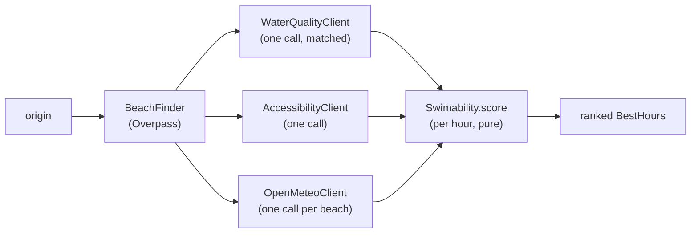

# Design

How marola-app is put together: four sbt modules, the pipeline that answers "what's the best hour
tomorrow to swim nearby?", the two places it uses AI and why they stay apart, and where the effect
boundary sits. The siblings go deeper: [Effects map](1-design_effects.md) (what is pure, what is
`< Sync`), [Heuristics](1-design_heuristics.md) (the scoring internals) and
[Integrations](1-design_integrations.md) (each pluggable backend). How marola fits with the other
repos is the umbrella's [Architecture](https://docs.marola.dev/2-Building-marola/ARCHITECTURE/).

## Modules

Traits live in `core`, `local` implements them, and `cli` is the one place that wires both
together ([ADR-0001](adr/0001-three-sbt-modules.md) has why). `oods`, the Open Ocean Data Store
ingest (MIP-0075), is the fourth: it builds on `local`, is the only module with DuckDB, and its
`marola.oods.Main` ships in `cli`'s assembly as a second entry point.

```d2
direction: right
core: "core/\npure pipeline, traits"
local: "local/\nOllama, MLflow, agency and file impls"
cli: "cli/\nMain, AppConfig, the servers"
oods: "oods/\nthe OODS ingest, DuckDB"
ml: "marola-ml\noffline DSPy compile"

local -> core: "implements the traits\n(LlmClient, VisionClient,\nSightingStore, ...)"
cli -> core: "depends on"
cli -> local: "depends on,\nwires via AppConfig"
oods -> local: "depends on"
cli -> oods: "ships oods.Main\nin the one jar"
ml -> core: "compiled prompts\n(a PR into resources)"
```

The DSPy compile, the fine-tune and the benchmark gate live in
[marola-ml](https://github.com/marola-dev/marola-ml), which runs this repo's image rather than
reading its tree.

## Module map

Every source, regenerated from `find core local oods cli -name '*.scala'`: the main sources by
package, then the tests.

```
core/src/main/scala/marola
  Recommender.scala                    the pipeline, from origin to ranked hours
  beaches
    BeachFinder.scala                  named beaches from Overpass, across three mirrors
    BeachSnapshot.scala                beach lists on disk (MAROLA_BEACHES_DIR)
    Facilities.scala                   Facility, Facilities and the AccessibilityClient trait (MIP-0021)
    NoopAccessibilityClient.scala      MAROLA_FACILITIES=off: no call, no data
    OverpassAccessibilityClient.scala  amenities within 300 m of each beach, one Overpass query
  conditions
    OpenMeteoClient.scala              hourly weather and marine data, in the beach's timezone
    Tides.scala                        tide turns from the hourly sea level (pure)
  http
    Http.scala                         java.net.http at the Sync boundary, with retries
  json
    Json.scala                         the hand-rolled JSON reader and writer
  knowledge
    Corpus.scala                       corpus loading, chunking, cosine
    FileKnowledgeStore.scala           the JSON vector index under data/
    KnowledgeStore.scala               the Embedder and KnowledgeStore traits, Passage
    OceanQa.scala                      grounded Q&A: retrieve, answer from the passages, fall back
    SafetyFooter.scala                 the emergency footer (MIP-0022)
  ledger
    RunLedger.scala                    the RunLedger trait and its Noop (MIP-0010)
  llm
    CompiledPrompt.scala               replays a DSPy-compiled artifact as chat messages
    LlmClient.scala                    the LlmClient trait, ChatMessage
    Reviewer.scala                     the second LLM pass that grades the draft
    TracedLlmClient.scala              one llm.<model> span per call
  location
    IpGeolocation.scala                origin from three IP providers, medoid vote
  log
    Log.scala                          the SLF4J wrapper
  lore
    SeaLore.scala                      the sourced "did you know?" paragraph
  model
    Models.scala                       Coordinates, Beach, HourlyConditions, BestHour, the enums
  observability
    Tracing.scala                      the Tracing trait and its Noop
  scoring
    Note.scala                         a scoring reason as a code plus arguments (MIP-0054)
    Swimability.scala                  the score, the heuristics, the water verdict (pure)
  sightings
    Sighting.scala                     Sighting, SightingKind
    SightingStore.scala                the SightingStore trait
  site
    Board.scala                        the per-area, per-day board JSON the map renders (pure)
  trails
    TrailFinder.scala                  named paths and tracks near the beaches (MIP-0030)
  vision
    VisionClient.scala                 the VisionClient trait
  water
    WaterQuality.scala                 samples, points, freshness, the WaterQualityClient trait
    WaterQualityMatcher.scala          agency points → OSM beaches (pure)

local/src/main/scala/marola
  knowledge
    OllamaEmbedder.scala              embeddings from Ollama's native /api/embed
  ledger
    MlflowApi.scala                   the MLflow REST calls the ledger and the tracer share
    MlflowRunLedger.scala             benchmark runs into a local MLflow server
  llm
    LocalLlmClient.scala              any OpenAI-compatible chat endpoint (Ollama by default)
  observability
    MlflowTracing.scala               OTLP/HTTP spans into MLflow
  sightings
    LocalFileSightingStore.scala      JSON lines in data/sightings.jsonl
  vision
    LocalVisionClient.scala           a multimodal Ollama model
  water
    CachedWaterQualityClient.scala    the last good fetch when the agency is down
    FallbackWaterQualityClient.scala  a primary source, then a backup when it gives nothing
    ImaScPdfParser.scala              IMA/SC's bulletin rows
    ImaScPdfWaterQualityClient.scala  IMA/SC's bulletin, joined to the feed's coordinates
    ImaScWaterQualityClient.scala     IMA/SC's JSON feed
    IneaPdfParser.scala               INEA/RJ's bulletin table
    IneaRjWaterQualityClient.scala    INEA/RJ's latest PDF per zone
    InemaBaWaterQualityClient.scala   INEMA/BA's bulletin PDF
    InemaPdfParser.scala              INEMA/BA's bulletin table
    PdfLines.scala                    PDF text with its geometry, for both parsers
    SamplingPointCoordinates.scala    bundled point → coordinate tables for RJ and BA

cli/src/main/scala/marola
  AppConfig.scala                  MAROLA_* settings and one factory per integration
  Main.scala                       the CLI (KyoApp): every mode in the CLI reference
  Report.scala                     the text output: ranked list, detailed block, lore, answers (pure)
  agent
    ChatServer.scala               --serve-chat: /health and /ask for the map's chat widget
    SwimConditionsMcpServer.scala  the four MCP tools over stdio
  bench
    BenchmarkLedger.scala          a benchmark report as an MLflow run
    OceanBenchmark.scala           --benchmark: 22 questions, three arms
  site
    SiteBuilder.scala              --site: the boards for every area of an --areas file

oods/src/main/scala/marola/oods
  Main.scala                       the oods CLI (MIP-0075 §5.4): usage and exit codes; no command yet
```

The tests, one spec per class or concern:

```
core/src/test/scala/marola
  beaches       AccessibilitySpec, BeachSnapshotSpec
  conditions    TidesSpec
  http          HttpSpec
  knowledge     CorpusSpec, RagOfflineSpec, SafetyFooterSpec
  ledger        NoopRunLedgerSpec
  llm           SummarizeFlowSpec, TracedLlmClientSpec
  location      IpGeolocationSpec
  lore          SeaLoreSpec
  model         CoordinatesSpec
  observability TracingSpec
  scoring       NoteSpec, SwimabilitySpec, WaterVerdictSpec
  trails        TrailFinderSpec
  water         WaterQualityMatcherSpec

local/src/test/scala/marola
  knowledge     OllamaEmbedderSpec
  ledger        MlflowRunLedgerSpec
  observability MlflowTracingSpec
  sightings     LocalFileSightingStoreSpec
  water         CachedWaterQualityClientSpec, ImaScPdfParserSpec, ImaScPdfWaterQualityClientSpec,
                ImaScWaterQualityClientSpec, IneaPdfParserSpec, IneaRjWaterQualityClientSpec,
                InemaBaWaterQualityClientSpec, InemaPdfParserSpec, SamplingPointCoordinatesSpec

cli/src/test/scala/marola
  AppConfigSpec, E2ESpec, PipelineGoldenSpec, ReportFacilitiesSpec
  agent         ChatServerSpec
  bench         BenchmarkLedgerSpec
  site          BoardSpec, SiteBuilderSpec

oods/src/test/scala/marola/oods
  MainSpec
```

## The pipeline

[`Recommender`](../core/src/main/scala/marola/Recommender.scala) finds the nearest named beaches
around the origin (six by default; each `--site` area sets its own), fetches the region's water
quality and the beaches' facilities once each, then one forecast per beach, and scores every hour
that falls on tomorrow in that beach's own timezone.
Hours rank by score, ties by distance from 10:00; `bestPerBeachTomorrow` keeps each beach's best
hour. `scoreDays` serves `--site`: today and tomorrow from one forecast per beach. The clock is
injected (`today: ZoneId => LocalDate`), the one clock read in the pipeline, so
`PipelineGoldenSpec` can pin "tomorrow" to its recorded fixtures.



A failing water or facilities call logs a warning and leaves every beach with "no data"; Overpass
failing on all three mirrors, or Open-Meteo failing, fails the run. Where the origin comes from
(flags, a Maps URL, env vars, IP geolocation) is in the
[CLI reference](4-reference_cli.md#recommendation-the-default).

## Two uses of AI, kept apart

marola runs AI in two places that answer to different rules. The split decides what may be wrong
and how you would find out. A third, forecasting with time-series models, is designed but not
built ([Architecture](https://docs.marola.dev/2-Building-marola/ARCHITECTURE/)).

**The map is deterministic: no model writes any number a visitor sees.**
[`SiteBuilder`](../cli/src/main/scala/marola/site/SiteBuilder.scala) has no LLM reference. Every
value on a board comes from a measured source or a pure function over one: Open-Meteo for sea and
weather, Overpass for beaches, trails and facilities, the agency feeds and bulletins for water
quality, `Tides` for the tide curve. The score and the water sentence come from
[`Swimability.score`](../core/src/main/scala/marola/scoring/Swimability.scala), a function with no
effect type: the same inputs give the same board. A wrong number there is a bug with a stack trace,
and `SwimabilitySpec` can pin it.

**The chat is a generative model, fenced in.**
[`ChatServer`](../cli/src/main/scala/marola/agent/ChatServer.scala) answers through
`config.llmClient`, grounded on `config.knowledgeStore` (RAG over the corpus). The model can be
marola's own marola-sea (MIP-0025, marola-ml's
[fine-tune](https://github.com/marola-dev/marola-ml/tree/main/finetune)): point
`MAROLA_LOCAL_LLM_MODEL` at it. Around it sit checks, not trust:

- [`Reviewer`](../core/src/main/scala/marola/llm/Reviewer.scala) is a second, separate LLM pass
  that grades the summarizer's draft before a user sees it (LLM-as-judge).
- [`SwimConditionsMcpServer`](../cli/src/main/scala/marola/agent/SwimConditionsMcpServer.scala)
  hands the deterministic half to agents as MCP tools, so an assistant gets measured data through a
  tool call rather than from the model's recollection.
- The safety footer, and the corpus's "sourced or clearly labelled" rule.

When something looks wrong, the split says where to look: a bad map value is a parser or scoring
bug; a bad chat answer is the model, retrieval or the prompt. It is also why the map needs no GPU
and no token.

## Beach distance

`BeachFinder` measures distance as the crow flies (`Coordinates.distanceKm`, haversine) to each
beach's OSM centre (`out center`). There is no routing backend, so a beach across a bay counts as
near. What that means for a user is in
[Limitations](https://docs.marola.dev/1-Using-marola/LIMITATIONS/#other-known-limitations-poc-stage-not-hidden).

## The effect boundary

Kyo effects mark real I/O: every HTTP, file and model call is `< Sync` (or `< Async` in `Main`),
and the scoring, matching, tides, lore, board and report code is plain functions with no effect
type. The one deliberate escape is the MCP server, whose Java SDK takes synchronous callbacks; the
hidden effect that matters most is `AppConfig.fromEnv`. Both are in the
[Effects map](1-design_effects.md).
