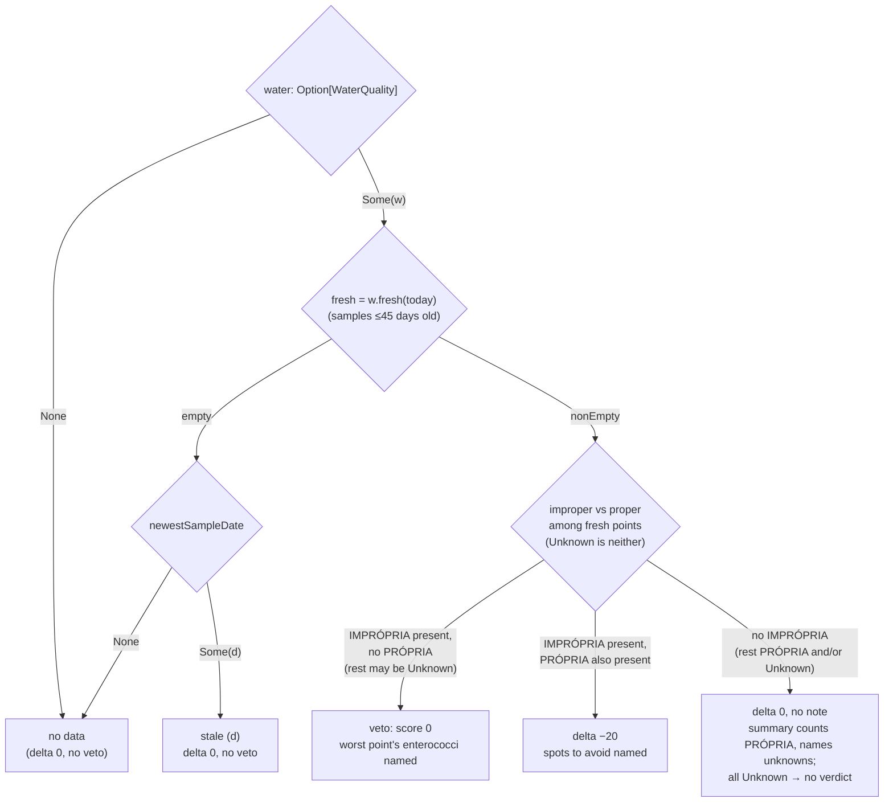

# Heuristics

The internals of the score, the jellyfish and whale heuristics, the water verdict and the other
pure rules behind a recommendation. What they cannot tell a swimmer, in words meant for one, is
[Limitations](https://docs.marola.dev/1-Using-marola/LIMITATIONS/); this page is the
mechanics, for changing them. Everything here is a pure function in `core`, with no effect type,
pinned by the spec named in each section.

## The score

[`Swimability.score`](../core/src/main/scala/marola/scoring/Swimability.scala) starts each hour at
100, adds every deduction, and clamps to 0–100. A water veto forces 0 whatever the rest says. Each
deduction carries a [`Note`](../core/src/main/scala/marola/scoring/Note.scala), a code plus
arguments that the CLI and the map word themselves (MIP-0054); a good hour has no notes.

| Signal | Deduction | Note |
|---|---|---|
| Waves ≥ 1.5 m | −40 | `rough_seas` |
| Waves ≥ 0.6 m | −15 | `choppy` |
| Wind ≥ 30 km/h | −25 | `strong_wind` |
| Wind ≥ 15 km/h | −10 | `breezy` |
| Sea < 20 °C | −20 | `cold_water` |
| Sea > 27 °C | −5 | `warm_water` |
| Rain chance ≥ 60 % | −10 | `rain_likely` |
| Jellyfish High / Moderate | −25 / −10 | `jellyfish_elevated` / `jellyfish_some` |
| Night (`is_day` false) | −60 | `dark` |
| Water: IMPRÓPRIA and PRÓPRIA points both fresh | −20 | `water_mixed` |
| Water: fresh IMPRÓPRIA, no PRÓPRIA | score 0 (veto) | `water_unfit` |
| Water: every sample older than 45 days | 0 | `water_stale` |
| No wave, wind or sea-temperature value | −5 each | `no_wave_data`, `no_wind_data`, `no_sea_temp_data` |

Missing rain or daylight data costs nothing. The wind bands are also exposed as
`Swimability.windLevel`, so the map shows the same word without re-deriving a threshold
(MIP-0009). Equal scores break by `hourPreference`, the distance from 10:00. Whale likelihood never
enters the score. Pinned by `SwimabilitySpec`.

## Jellyfish risk

No jellyfish-bloom API exists, so `jellyfishRisk` counts four ecological correlates:

| Signal | Threshold |
|---|---|
| Warm sea | sea temperature ≥ 24 °C |
| Weak wind | wind ≤ 15 km/h |
| Calm sea | waves ≤ 0.6 m |
| Weak current | current ≤ 2 km/h |

Three or four true is High, two Moderate, otherwise Low. A missing value counts as false, so
missing data lowers the risk. Three of the four are also what makes a pleasant swim, so a calm day
is often flagged; `SwimabilitySpec` pins that rather than hides it. The thresholds are hand-tuned,
not fitted to any data.

## Whale sighting likelihood

`whaleSightingLikelihood` is Low outside July–November (the humpback migration along the
Brazilian coast) and at night. Otherwise it counts two visibility signals, wind ≤ 20 km/h and waves
≤ 1.0 m, looser than the swim thresholds because you only need to spot a blow: both is High, one
Moderate. `Recommender` also keeps each day's whale peak, the daylight hour with the highest
likelihood, which the detailed block and the board show.

## The water verdict

`Swimability.waterVerdict` turns a beach's matched sampling points into a deduction, a veto or
neither (MIP-0001 §6). It runs once per beach per day, not per hour. A sample is fresh when it is at
most 45 days old (`WaterQuality.MaxSampleAgeDays`: IMA samples monthly off-season), counted from
the agency's own sample date. The agency's PRÓPRIA/IMPRÓPRIA is used as published (CONAMA
274/2000), never re-derived from the enterococci counts. Pinned by `WaterVerdictSpec`.

No data, no match or the provider `none` leave the score alone: absence of data is not evidence of
pollution. A point whose condition is missing or unrecognised is Unknown and counts as neither.

### Matching points to beaches

[`WaterQualityMatcher.assign`](../core/src/main/scala/marola/water/WaterQualityMatcher.scala)
gives each agency point to at most one OSM beach. First by name: accents and case folded, a leading
"Praia do/da/de…" and anything in parentheses dropped, and one name may be a word prefix of the
other ("Campeche" matches "Campeche Sul"). An unmatched point then goes to the nearest beach within
2.5 km, unless its name starts with an inland-water word (Lagoa, Lago, Canal, Rio, Foz, Represa,
Barragem): Lagoa da Conceição's point 72 sits 1.3 km from Praia da Joaquina's centre and would
otherwise be attached to it. Pinned by `WaterQualityMatcherSpec`.

## Tides

[`Tides.extrema`](../core/src/main/scala/marola/conditions/Tides.scala) reads high and low water
off Open-Meteo's hourly `sea_level_height_msl`: a local peak or trough is a candidate. Kept turns alternate; a same-type candidate replaces the kept one when more extreme, and
an opposite-type one less than 0.1 m away from the last kept turn is dropped as sampling noise.
There is no tide-table API or harmonic model, so a turn is only as precise as the hour. Pinned by
`TidesSpec`.

## Sea lore

[`SeaLore.pick`](../core/src/main/scala/marola/lore/SeaLore.scala) chooses one entry of
`core/src/main/resources/sea_lore.json` (eight, each with a source URL; an entry without one is
dropped on load). Entries filter by region (`global` everywhere, `BR-S` on the south and south-east
Brazilian coast, a bounding box) and by month, then one is chosen by a seed of the date and the
beach name: the same beach on the same day gives the same paragraph. It is appended verbatim and
never passes through a model, so the reviewer does not see it (a deliberate deviation from MIP-0001
§5.4). Pinned by `SeaLoreSpec`.

## Calibration: not wired yet

The thresholds above are constants.
[`SightingStore`](../core/src/main/scala/marola/sightings/SightingStore.scala) (`--report-sighting`) and [`VisionClient`](../core/src/main/scala/marola/vision/VisionClient.scala)
(`--analyze-photo`) exist to collect real reports, but nothing reads them back into a threshold or
weight. Doing so, or feeding reports into marola-ml's prompt trainset, is future work; MIP-0007's
forecasting is one candidate for the calibration.
