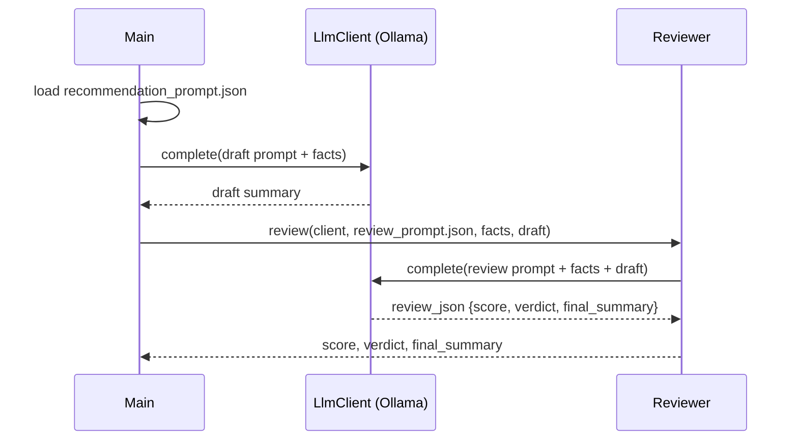
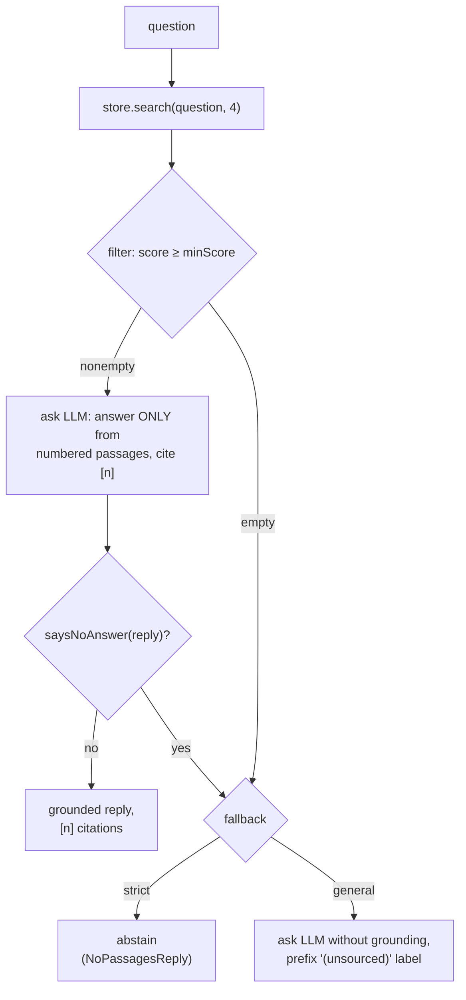

# Integrations

Each pluggable backend: the trait in `core`, the local (free) implementation, how `AppConfig` wires
it, and what has been verified. A cloud backend would be one more implementation of the same trait,
opt-in per integration (GCP is the path under discussion, MIP-0057). The endpoints and their terms
are in [Data sources](4-reference.md), the variables in the
[Configuration reference](4-reference_config.md).

| Integration | Trait (`core`) | Local implementation | `AppConfig` | Status |
|---|---|---|---|---|
| [Query synthesis](#query-synthesis) | `LlmClient` | `LocalLlmClient` (Ollama) | `llmClient`, `tracedLlmClient` | Run live |
| [Agentic tool access](#agentic-tool-access) | — | `SwimConditionsMcpServer` (stdio) | reads `fromEnv` per call | Run live over raw JSON-RPC |
| [Chat server](#chat-server) | — | `ChatServer` (JDK HTTP server) | `knowledgeStore`, `llmClient` | Tested offline (`ChatServerSpec`) |
| [Sighting reports](#sighting-reports) | `SightingStore` | `LocalFileSightingStore` (JSON lines) | `sightingStore` | Run live |
| [Photo analysis](#photo-analysis) | `VisionClient` | `LocalVisionClient` (multimodal Ollama) | `visionClient` | Request path run live; no description yet |
| [Observability](#observability) | `Tracing`, `RunLedger` | `MlflowTracing`, `MlflowRunLedger` | `tracing`, `runLedger` | Tested offline |
| [Bathing-water quality](#bathing-water-quality) | `WaterQualityClient` | IMA/SC, INEA/RJ, INEMA/BA clients | `waterQualityClient(origin)` | Run live |
| [Facilities](#facilities-and-trails) | `AccessibilityClient` | `OverpassAccessibilityClient`, `NoopAccessibilityClient` | `accessibilityClient` | Run live |
| [Ocean knowledge](#ocean-knowledge-retrieval) | `Embedder`, `KnowledgeStore` | `OllamaEmbedder`, `FileKnowledgeStore` | `knowledgeStore` | Run live; default embedder broken on current Ollama ([#12](https://github.com/marola-dev/marola-app/issues/12)) |

Callers take the trait, never the implementation class: that is what keeps `core` free of any
backend reference, and the review style guide flags the opposite.

## Query synthesis

The ranked list is useful without a model: every number comes from data and a deterministic rule.
The LLM's job is narrower, turning the top row into a sentence or two, and the ranking stays
outside it on purpose.

- [`LlmClient`](../core/src/main/scala/marola/llm/LlmClient.scala) is the trait (`complete`
  over chat messages). [`LocalLlmClient`](../local/src/main/scala/marola/llm/LocalLlmClient.scala)
  calls any OpenAI-compatible `/chat/completions`: Ollama by default, or LM Studio or a llama.cpp
  server.
- [`CompiledPrompt`](../core/src/main/scala/marola/llm/CompiledPrompt.scala) loads a
  DSPy-compiled artifact,
  [`recommendation_prompt.json`](../core/src/main/resources/recommendation_prompt.json), and replays
  it as messages: the instructions as the system message, each demo as a user/assistant pair, the
  real input last. It mirrors DSPy's `ChatAdapter` in good faith, not byte for byte. The JSON shape
  is the real output of `dspy.Predict(...).save()` (dspy 3.3.1); `outputField` names the output,
  `summary` here.
- [`Reviewer`](../core/src/main/scala/marola/llm/Reviewer.scala) replays a second artifact,
  [`review_prompt.json`](../core/src/main/resources/review_prompt.json) (`outputField`
  `review_json`), over the draft and the same facts. It checks the jellyfish and whale mention
  policy and that the draft asserts nothing outside the facts, and returns a 0–100 score, a verdict
  (`approve`/`revise`) and a `final_summary`, its own correction on `revise`. The output is one JSON
  string rather than three fields so it reuses the single-output replay; the first `{…}` in the
  reply is parsed, because small models wrap JSON in prose.

Both artifacts are compiled offline by marola-ml's
[`dspy/compile_recommendation_prompt.py`](https://github.com/marola-dev/marola-ml/blob/main/dspy/compile_recommendation_prompt.py)
(`BootstrapFewShot`, with a metric that rewards mentioning jellyfish risk, and whale likelihood less,
when Moderate or High) and land here as a bot PR. `--summarize` always runs both passes.

**Verified** end to end against local Ollama models: the compile with `dolphin-mixtral:8x7b`
(its demos carry `"augmented": true`), and `--summarize` replaying the result. The reviewer returned
well-formed JSON from both that model and `llama3.2:1b`, and in one bootstrap run caught a planted
draft missing its jellyfish mention. Small models follow instructions imperfectly: one mentioned a
whale at `Low`, and the 1B reviewer's corrections fixated on whales over jellyfish. The daily
`docker-smoke.yml` runs `--summarize` with `llama3.2:1b` and fails when the reviewer does not
answer ([Development](3-development.md#ci-workflows)).

## Agentic tool access

[`SwimConditionsMcpServer`](../cli/src/main/scala/marola/agent/SwimConditionsMcpServer.scala)
exposes the pipeline as four MCP tools (`find_nearby_beaches`, `get_swim_recommendation`,
`get_water_quality`, `ask_ocean_question`; arguments and results in the
[CLI reference](4-reference_cli.md#mcp-server)), so an agent decides when to call what instead of
`Recommender` fixing the order. It speaks stdio (`StdioServerTransportProvider`), which needs no
network exposure; `.mcp.json` registers it for Claude Code as `just mcp-server`. A remote client
would need the SDK's servlet transports and a public endpoint, which is a deployment and not wired.

The SDK's tool handlers are plain synchronous Java callbacks, so the server runs each Kyo effect
with `Sync.Unsafe.evalOrThrow` under `AllowUnsafe.embrace.danger`, Kyo's documented escape hatch
for a foreign-callback boundary
([Effects map](1-design_effects.md#3-the-one-deliberate-unsafe-boundary-swimconditionsmcpserver)).
Each call reads `AppConfig.fromEnv` afresh.

Two build traps it left behind: the assembly concatenates `META-INF/services/*` before discarding
the rest of `META-INF`, or the SDK's `ServiceLoader` finds no JSON-schema validator; and
`Compile / run / mainClass` is pinned to `marola.Main`, so the server runs as
`cli/runMain marola.agent.SwimConditionsMcpServer`.

**Verified** by piping raw JSON-RPC (`initialize`, `notifications/initialized`, `tools/list`,
`tools/call`) into the assembled jar, with live Overpass and Open-Meteo answers, when it had its
first two tools. A session from a real MCP client is not recorded.

## Chat server

[`ChatServer`](../cli/src/main/scala/marola/agent/ChatServer.scala) (`--serve-chat`, MIP-0033)
wraps `OceanQa.answer` and the safety footer behind `/health` and `/ask`, so the map's chat widget,
reached through a tunnel to the machine running it, gets a grounded answer with the footer instead
of talking to Ollama directly. Its endpoints are in the
[CLI reference](4-reference_cli.md#chat-server); running and exposing it is
[Chat and MCP](https://docs.marola.dev/1-Using-marola/CHAT-AND-MCP/).

## Sighting reports

[`SightingStore`](../core/src/main/scala/marola/sightings/SightingStore.scala) (`record`,
`recentFor`) with
[`LocalFileSightingStore`](../local/src/main/scala/marola/sightings/LocalFileSightingStore.scala),
one JSON object per line in `data/sightings.jsonl`. It is the collection half of the heuristics'
calibration loop ([Heuristics](1-design_heuristics.md#calibration-not-wired-yet)). A user would
report through the Telegram bot, which is Phase 1 and not built; `--report-sighting` is the local
stand-in.

**Verified**: `--report-sighting jellyfish Arpoador "note"` wrote a correctly shaped line, read
back from the file.

## Photo analysis

[`VisionClient`](../core/src/main/scala/marola/vision/VisionClient.scala) (`describe(imageBytes)`)
with [`LocalVisionClient`](../local/src/main/scala/marola/vision/LocalVisionClient.scala): a
multimodal Ollama model (`llava`, `moondream`) over the same `/chat/completions` endpoint, the image
as a base64 `image_url` content part. Photos would also arrive through the bot; `--analyze-photo
<path>` is the stand-in.

**Verified** up to the model: the encoding, the request shape, the round trip, and Ollama's
`model 'llava' not found` surfacing through `Abort` instead of a crash. No multimodal model was
installed, so no description has been checked.

## Observability

Infra tracing and one span per LLM call behind a vendor-free trait (MIP-0010).
[`Tracing`](../core/src/main/scala/marola/observability/Tracing.scala) has `withSpan` and `llmSpan`;
`Tracing.Noop` is the default. `MAROLA_TRACES=mlflow` picks
[`MlflowTracing`](../local/src/main/scala/marola/observability/MlflowTracing.scala) in
`AppConfig.tracing`, which `Main` resolves once per run; a server that is down prints a warning and
traces nothing, so observability never fails a recommendation. A recommendation is one trace:
`marola.recommend`, with `bestPerBeachTomorrow`, `trails` and the draft and review `llm.<model>`
spans under it. `--ask` is traced too.

- `MlflowTracing` exports OTLP/HTTP to `<MAROLA_MLFLOW_TRACKING_URI>/v1/traces`, with the
  `x-mlflow-experiment-id` header MLflow requires; the id of `<prefix>/traces` is resolved over REST
  by [`MlflowApi`](../local/src/main/scala/marola/ledger/MlflowApi.scala). Each span is exported as
  it ends (`SimpleSpanProcessor`): a short-lived CLI has no moment to flush a batch. Nesting is an
  `AtomicReference` to the current span rather than OpenTelemetry's thread-local context, which a
  Kyo effect may not stay on: exact for the CLI's one linear pipeline, wrong for concurrent ones. A
  failing effect ends its span with `ERROR` and rethrows.
- [`TracedLlmClient`](../core/src/main/scala/marola/llm/TracedLlmClient.scala) wraps the LLM
  client (`AppConfig.tracedLlmClient`): `gen_ai.operation.name`, `gen_ai.request.model`, message
  count and prompt and completion sizes in characters. No token counts: `LlmClient.complete` drops
  the response's `usage`. The prompt and completion text are recorded only with
  `MAROLA_TRACE_CONTENT`, because the prompt carries the swimmer's coordinates.
- [`RunLedger`](../core/src/main/scala/marola/ledger/RunLedger.scala) is the experiment-tracking
  half: [`MlflowRunLedger`](../local/src/main/scala/marola/ledger/MlflowRunLedger.scala) when the
  tracking URI is set, `RunLedger.Noop` (no call) otherwise. `--benchmark` logs to it through
  [`BenchmarkLedger`](../cli/src/main/scala/marola/bench/BenchmarkLedger.scala).

**Tested offline** against OpenTelemetry's in-memory exporter (`MlflowTracingSpec`: names,
attributes, nesting, error status, endpoint and header) and scripted MLflow responses
(`MlflowRunLedgerSpec`). A trace into a live `just mlflow-up` server is not recorded; the run to
check it is in [Development](3-development.md#observability).

## Bathing-water quality

Each Brazilian state's agency publishes its own samples, so the provider follows the origin
(MIP-0001, MIP-0031). `AppConfig.waterQualityClient(origin)` picks IMA/SC, INEMA/BA or INEA/RJ by
bounding box (or as `MAROLA_WATER_QUALITY_PROVIDER` forces) and wraps it: for IMA/SC first in
`FallbackWaterQualityClient` (the feed, then the bulletin PDF when the feed gives nothing), then for
every agency in `CachedWaterQualityClient` (the last good fetch, under `data/water-cache/`).

- [`ImaScWaterQualityClient`](../local/src/main/scala/marola/water/ImaScWaterQualityClient.scala):
  one empty `POST` to the JSON feed the portal's map uses, about 260 points with coordinates and
  their last five samples, parsed tolerantly. A point with no dated sample is dropped; since 2026-10
  the feed sends none, so it gives nothing and the bulletin takes over (#57).
- [`ImaScPdfWaterQualityClient`](../local/src/main/scala/marola/water/ImaScPdfWaterQualityClient.scala):
  the newest weekly bulletin, found from the portal's index rather than pinned.
  [`ImaScPdfParser`](../local/src/main/scala/marola/water/ImaScPdfParser.scala) reads its dates and
  verdicts, which carry no coordinates, so rows are joined by beach and point name to the feed's
  point list. It covers the feed being unreachable, or sending no samples, while the bulletin is up.
- [`IneaRjWaterQualityClient`](../local/src/main/scala/marola/water/IneaRjWaterQualityClient.scala)
  and [`InemaBaWaterQualityClient`](../local/src/main/scala/marola/water/InemaBaWaterQualityClient.scala):
  bulletin PDFs only, read by [`IneaPdfParser`](../local/src/main/scala/marola/water/IneaPdfParser.scala)
  and [`InemaPdfParser`](../local/src/main/scala/marola/water/InemaPdfParser.scala), placed with
  hand-curated coordinate tables
  ([`SamplingPointCoordinates`](../local/src/main/scala/marola/water/SamplingPointCoordinates.scala)).
  INEA's PDFs are found on its city pages, INEMA's on its listing page, each dated by its file name.
- [`PdfLines`](../local/src/main/scala/marola/water/PdfLines.scala) keeps each line's position:
  read in natural order these tables pair a verdict with the wrong beach, which for a safety verdict
  is a wrong answer, not a formatting bug.
- [`CachedWaterQualityClient`](../local/src/main/scala/marola/water/CachedWaterQualityClient.scala)
  writes only a non-empty fetch. Serving the cache is not serving stale data: freshness is judged
  on the agency's sample dates, which do not move because a download failed.

`Recommender` makes one call per run and matches the points to beaches; the matching and the
verdict are pure and on [Heuristics](1-design_heuristics.md#the-water-verdict). The tide turns
(`Tides`) and sea lore (`SeaLore`) that MIP-0001 added beside it are there too.

**Verified** live from Campeche on 2026-09-05: point 73 (Riozinho) IMPRÓPRIA at 749
enterococci/100 mL, the other four PRÓPRIA, Campeche −20 with the spot named. Each parser has a
real bulletin as its fixture, and `PipelineGoldenSpec` replays a recorded IMA response
([Development](3-development.md#testing)). The feed is undocumented and samples go stale
off-season (MIP-0001 §8).

## Facilities and trails

Two more Overpass queries per run, on the same public instance as `BeachFinder`:
[`OverpassAccessibilityClient`](../core/src/main/scala/marola/beaches/OverpassAccessibilityClient.scala)
counts parking, toilets, showers and lifeguards within 300 m of each beach (MIP-0021;
`MAROLA_FACILITIES=off` swaps in `NoopAccessibilityClient`, so the call site never special-cases
"off"), and [`TrailFinder`](../core/src/main/scala/marola/trails/TrailFinder.scala) finds named
paths and tracks near the beaches, with OSM's `sac_scale` and `surface` copied verbatim or left
empty, never guessed (MIP-0030). Both follow `BeachFinder`'s single-source shape, not the water
clients' one per region: OSM's coverage is global.

## Ocean knowledge: retrieval

Grounded Q&A over [marola-corpus](https://github.com/marola-dev/marola-corpus)'s Markdown documents
at the release `corpus.version` pins (`.tmp/knowledge` locally, `/app/knowledge` in the image).
How the corpus reaches this repo and marola-ml is the umbrella's
[Architecture](https://docs.marola.dev/2-Building-marola/ARCHITECTURE/); this is the in-app half.

- [`Corpus`](../core/src/main/scala/marola/knowledge/Corpus.scala) reads every `.md` directly
  under the directory and under its `safety/`, and merges paragraphs into chunks of at most 700
  characters, each keeping its document's title and `Source:` URL.
- [`OllamaEmbedder`](../local/src/main/scala/marola/knowledge/OllamaEmbedder.scala) embeds through
  Ollama's native `/api/embed`, not the `/v1` the chat uses. Its default, `llama3.2`, is a chat
  model, which current Ollama refuses to embed with
  ([#12](https://github.com/marola-dev/marola-app/issues/12)); set `MAROLA_LOCAL_EMBED_MODEL`
  ([Choosing the embedder](4-reference_config.md#choosing-the-embedder)).
- [`FileKnowledgeStore`](../core/src/main/scala/marola/knowledge/FileKnowledgeStore.scala) keeps
  the vectors as JSON under `data/`, re-embeds when a fingerprint of the corpus files (names, sizes,
  mtimes) and the model changes, and ranks by cosine.
- [`OceanQa`](../core/src/main/scala/marola/knowledge/OceanQa.scala) asks the model to answer only
  from the top four passages, citing `[n]`, or to reply `NO_ANSWER_IN_PASSAGES`. With nothing
  relevant (no passage at `MAROLA_ASK_MIN_SCORE` or above, or that reply), `strict` abstains,
  never calling the model when no passage qualifies, and `general` answers from the model's own
  knowledge under an "unsourced" label. `--ask` defaults to `general`; the chat server and MCP use `strict`.
- [`SafetyFooter`](../core/src/main/scala/marola/knowledge/SafetyFooter.scala) appends the
  emergency footer to any answer drawn from a `safety/` document (MIP-0022).

[`OceanBenchmark`](../cli/src/main/scala/marola/bench/OceanBenchmark.scala) (`--benchmark`, `just
benchmark`) puts 22 questions, ten inside the corpus and twelve outside, through three arms on the
same model: the plain prompt, strict and general. Its scores are deterministic (keyword coverage,
citation, abstention, latency) and its report ends with a computed verdict. marola-ml's gate keeps
the runs; the
[2026-09-05 baseline](https://github.com/marola-dev/marola-ml/blob/main/docs/benchmarks/2026-09-05.md)
had general beating the plain prompt 0.84 to 0.75 overall and 0.92 to 0.55 inside the corpus, after
the `NO_ANSWER_IN_PASSAGES` stage was added, with `llama3.2` embeddings. Fine-tuning targets format
and tone, not facts, and lives in marola-ml's
[fine-tune](https://github.com/marola-dev/marola-ml/tree/main/finetune).
