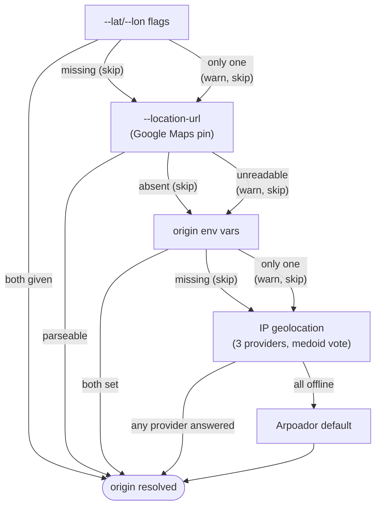
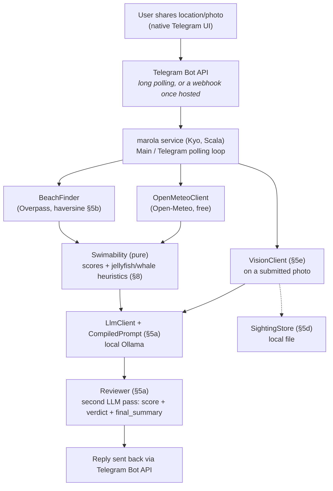
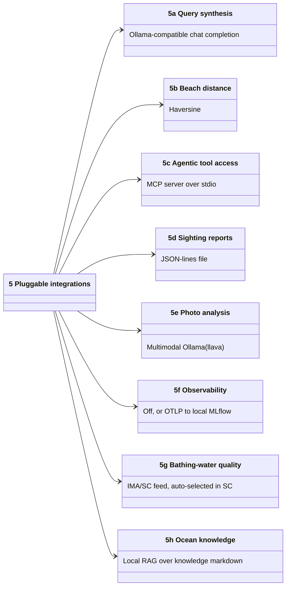
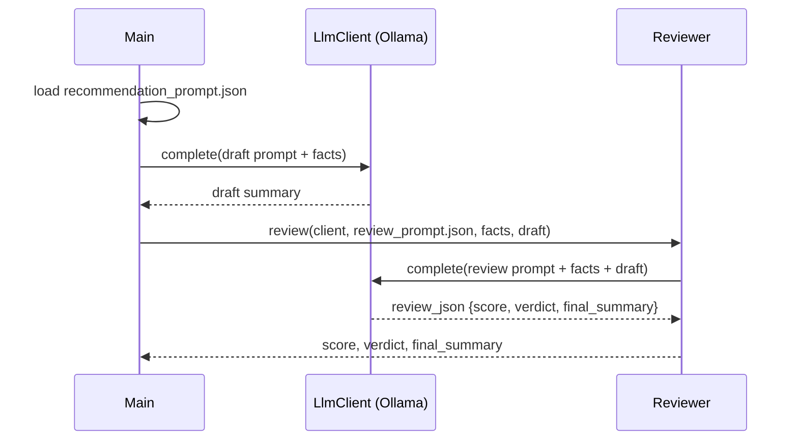
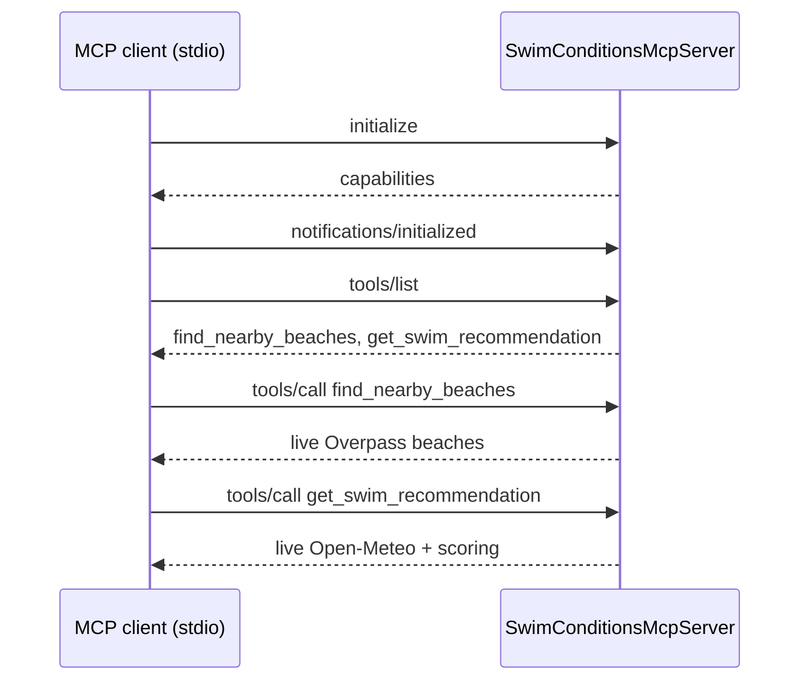
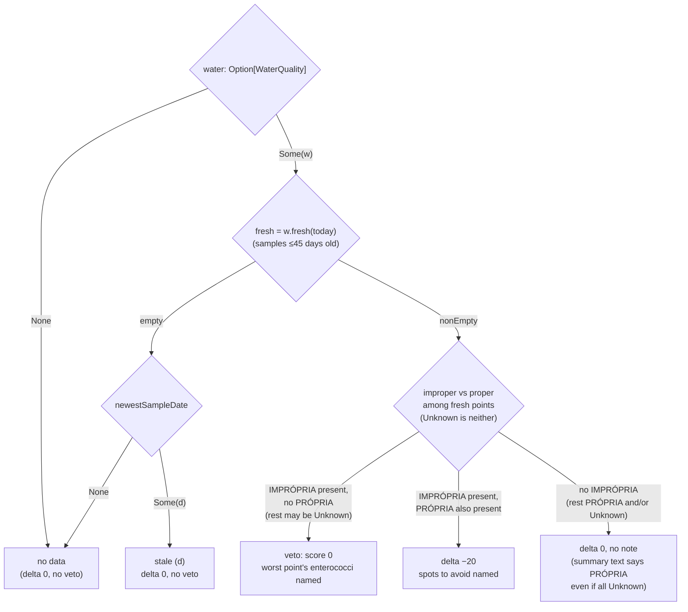
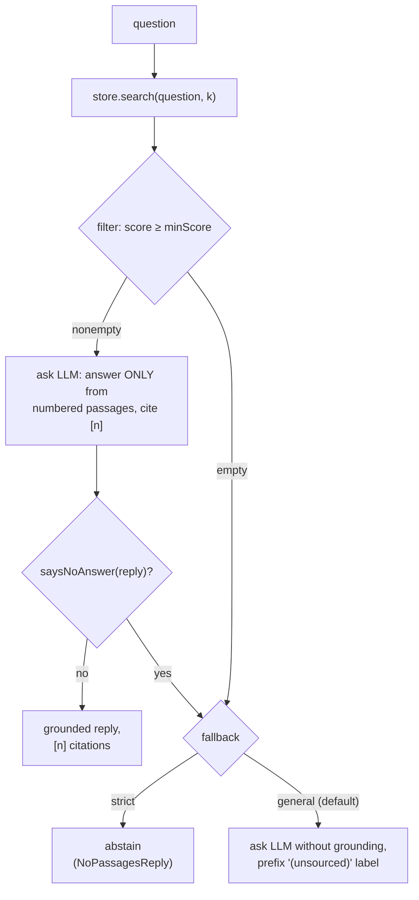

# Architecture

**Status:** POC pipeline plus six pluggable integrations, all with local implementations,
implemented and compiling; most exercised live (see the per-feature "Verified" notes in §3). No
cloud resources provisioned, no Telegram bot registered yet.

Related docs: [`FUTURE-WORK.md`](../4-Research-and-plans/FUTURE-WORK.md) (multi-activity support: diving, surfing, any
sea-related activity; three reviewed-not-adopted/deferred dependencies; evaluation-harness ideas),
[`EFFECTS-MAP.md`](./EFFECTS-MAP.md) (a Scala/FP-purity review: what's pure, what's `< Sync`, and
the one hidden untracked effect worth knowing about), [`RUN-LOCALLY.md`](../1-Using-marola/RUN-LOCALLY.md) (a
step-by-step guide to running the whole pipeline with a small local Ollama model, no Telegram, no
cloud account), and [`TELEGRAM-SETUP.md`](../1-Using-marola/TELEGRAM-SETUP.md) (registering the bot and
configuring its credentials).

marola is built around a language model synthesis step actually driven by an **offline-compiled
DSPy prompt**, and a **local-first design**: every integration below runs on a free, local
backend.

## 1. Problem & product vision

marola is the ocean intelligence layer for a stretch of coast; its first use case (this MVP) is:

**MVP hypothesis:** a Telegram message ("what's the best hour tomorrow to swim nearby?") gets
back a ranked list of nearby open-water swim spots, each with its best hour tomorrow, sea
temperature, wind, wave height, a jellyfish-likelihood heuristic, and (informational, not
safety-relevant; see §8) a whale-sighting-likelihood heuristic, backed by live marine/weather data
and a Telegram-native location share, not a typed-in address.

**Non-goals for the POC:** multi-day forecasts, saved/favorite spots, push notifications
("tell me when conditions turn good"), any deployment at all yet.

## 2. Why Telegram, not WhatsApp or a Streamlit page

This is a personal tool with no closed-beta allowlist or business-identity requirement, so the
interface choice came down to Telegram vs. a Streamlit web app:

| | Telegram bot | Streamlit page |
|---|---|---|
| Location sharing | Native "Share Location" (one-time or live), built into every client, no extra code | Needs the browser Geolocation API + a JS bridge component (Streamlit has no direct JS access) — extra dependency, extra permission prompt per session |
| Mobile experience | First-class — it's a chat app | Fine, but a browser tab is a step down from "message a bot" for something you'd check standing on a beach |
| Hosting | Long-polling works with **no public HTTPS endpoint** (see §6) — can run from a laptop for the POC | Needs a hosted, publicly reachable process from day one |
| Auth | Telegram user ID *is* the identity — "borrow, don't build" | Needs its own session/identity story |

Telegram wins on every axis that matters for this use case. **Decision: Telegram bot.**

## 3. What's actually built

A real, runnable pipeline plus six independently pluggable integrations: no mocks, no stubs
pretending to be real:

Three sbt modules at the repo root: `core`, `local`, `cli` (see `FUTURE-WORK.md` §7.3 for why, and
the dependency-inversion fix that keeps `core` free of any backend-specific reference):

```
core/src/main/scala/marola/
  Recommender.scala              orchestrates the core pipeline, scores every nearby beach
  beaches/BeachFinder.scala      nearby beaches via OpenStreetMap Overpass (free, no key) —
                                  nodes, ways AND relations (most large beaches are relations)
  conditions/OpenMeteoClient.scala   hourly sea temp / wave height / wind / current / daylight
                                      via Open-Meteo (free, no key)
  scoring/Swimability.scala      pure heuristic scoring — jellyfish risk + whale sighting
                                  likelihood, no I/O, unit-tested
  llm/                           §5a — LlmClient (trait), CompiledPrompt (replays a
                                  DSPy-compiled artifact), Reviewer (a second LLM pass that
                                  grades/can override the summarizer's output)
  water/                         §5g — WaterQuality model, WaterQualityClient (trait),
                                  WaterQualityMatcher (pure: agency points → OSM beaches)
  conditions/Tides.scala         §5g — tide turns from Open-Meteo's hourly sea level (pure)
  lore/SeaLore.scala             §5g — curated, sourced "did you know?" paragraph (verbatim)
  site/Board.scala               MIP-0005 — the per-area, per-day board JSON the static map
                                  renders (pure serializer; contract:
                                  cli/src/main/resources/board.schema.json)
  knowledge/                     §5h — Embedder + KnowledgeStore (traits), Corpus chunker,
                                  FileKnowledgeStore (JSON vector index), OceanQa (grounded Q&A)
  sightings/                     §5d — SightingStore (trait) + Sighting model
  vision/                        §5e — VisionClient (trait)
  http/Http.scala                java.net.http.HttpClient wrapped at the Kyo Sync boundary
                                  (JSON POST, form POST, raw-bytes POST, GET)
  json/Json.scala                minimal hand-rolled JSON reader AND writer (no JSON library
                                  dependency)
  model/Models.scala             Coordinates, Beach, HourlyConditions, BestHour, JellyfishRisk,
                                  WhaleSightingLikelihood

local/src/main/scala/marola/     the local backends — the always-available path
  llm/LocalLlmClient.scala       local Ollama chat backend
  vision/LocalVisionClient.scala local multimodal Ollama backend
  sightings/LocalFileSightingStore.scala   JSON-lines file store
  water/ImaScWaterQualityClient.scala      §5g — IMA/SC bathing-water feed (Santa Catarina)
  knowledge/OllamaEmbedder.scala           §5h — embeddings via Ollama's native /api/embed

cli/src/main/scala/marola/       depends on core + local — the one place that wires the
                                  backends together
  Main.scala                     CLI entry point (KyoApp) — see §3.1 for its flags
  Report.scala                   pure text rendering: ranked list, detailed block, lore, answers
  site/SiteBuilder.scala         MIP-0005 — `--site`: boards for every area of an `--areas` file
                                  into site/dist/ (data only — MIP-0070 §5.4; the caller copies
                                  site/static/, the Leaflet page, itself)
  AppConfig.scala                env config + a llmClient/sightingStore/visionClient/tracing
                                  factory method per pluggable integration
  agent/SwimConditionsMcpServer.scala   §5c — exposes BeachFinder/Recommender as MCP tools

dspy/
  compile_recommendation_prompt.py   offline DSPy compile step (§5a) — defaults to a local Ollama
                                      model, run for real against one (see Status note below);
                                      optional Langfuse tracing
```

The tree above lists what's in each module; the dependency direction it can't show — traits live in
`core`, `local` implements them, `cli` is the one place that wires both together:

```d2
direction: right
core: "core/\npure pipeline, traits"
local: "local/\nOllama + file-based impls"
cli: "cli/\nMain, AppConfig, MCP server"
dspy: "dspy/\noffline DSPy compile"

local -> core: "implements the traits\n(LlmClient, VisionClient,\nSightingStore, ...)"
cli -> core: "depends on"
cli -> local: "depends on,\nwires via AppConfig"
dspy -> core: "recommendation_prompt.json\n(compiled artifact, in resources)"
```

### 3.1 `Main`'s CLI surface

```
just run                                          # ranked list + detailed block + lore, no LLM
just run -- --lat <lat> --lon <lon>                # explicit location (else env vars, else IP — §3.1)
just run -- --location-url <google-maps-url>       # the same, from a Google Maps pin (MIP-0008 §5.6)
just run -- --summarize                            # + LLM natural-language summary (§5a)
just run -- --report-sighting <jellyfish|whale|pollution> <beach> [note]   # §5d
just run -- --analyze-photo <path>                  # §5e
just run -- --brief                                 # the pre-MIP-0001 one-line list, no block/lore
just run -- --ask "<question>"                      # §5h — grounded Q&A over the corpus (just ask ...)
just run -- --reindex                               # §5h — re-embed the corpus (just knowledge-index)
just run -- --site [area]                           # MIP-0005 — the map's boards into site/dist (add --areas <file>)
```

Since MIP-0001 the default output is the ranked list with a **water-quality column**, a
**detailed block** for the top pick (per-point water quality, waves/period/swell, tide turns,
air, jellyfish, whales), the summary/review if `--summarize`, and one **sea-lore paragraph**
(`MAROLA_SEA_LORE=off` or `--no-lore` to drop it). See `RUN-LOCALLY.md` §4 for a real run.

Sample output against live data:

```
marola :: best hour tomorrow to swim nearby (POC)
origin -> lat=-22.9878, lon=-43.1913 (radius 15km)
 1. [ 75/100] Praia do Diabo         (0.2km away)  best at Sat 5 Sep, 00:00  |  23.5°C sea, 14km/h wind  |  jellyfish: Moderate  |  choppy (1.0m waves), some jellyfish likelihood
 2. [ 75/100] Cossetti's Playgroung  (3.2km away)  best at Sat 5 Sep, 00:00  |  23.5°C sea, 14km/h wind  |  jellyfish: Moderate  |  choppy (1.0m waves), some jellyfish likelihood
 ...
```

The whale-sighting field only shows up when non-`Low` (suppressed above because midnight has no
daylight); confirmed against live September daytime data instead: `06:00-10:00` all show `High`.

**Where "nearby" is measured from.** `Main` resolves the origin in this order and prints which one
it used on the `origin ->` line:

1. `--lat`/`--lon` flags (both required: one without the other is ignored with a warning).
2. `--location-url <url>`: a Google Maps pin, the `/@lat,lon` viewport, `q=`/`query=`/`ll=`, or the
   `!3dlat!4dlon` of a place URL (`Coordinates.fromMapsUrl`, pure, `CoordinatesSpec`). A short
   `maps.app.goo.gl` link has to be expanded first (`curl -sIL`); an unreadable URL warns and is
   ignored.
3. `MAROLA_ORIGIN_LAT`/`MAROLA_ORIGIN_LON` env vars (same both-or-neither rule).
4. **IP geolocation** (`core/location/IpGeolocation.scala`): three free, keyless providers
   (ipinfo.io, ipwho.is, ip-api.com) are queried and the medoid answer wins, so a single provider
   mapping a Brazilian ISP's block to its head-office city is outvoted rather than trusted. The
   output says how many providers agreed (`3/3`, `2/3`, ...). Accuracy is city-level at best, so
   the search radius is widened to at least 20km (never narrowed below `MAROLA_BEACH_SEARCH_RADIUS_KM`
   if that's larger). Verified live from Florianópolis: all three providers agreed, the medoid
   landed in the centro, and the island's beaches came back.
5. The built-in Arpoador default, only if no provider answered at all (offline).



No cloud account, no Telegram token are needed for any of the above. Every integration is
free/local, see §5's table.

## 3b. Two different uses of AI today, a third planned — deliberately not one

marola runs AI in two places that answer to different rules, and conflating them is the easiest way
to misread the codebase. The distinction is not stylistic: it decides what may be wrong, and how
you would find out. A third use is designed but not built, and is kept separate from both for the
same reason.

**The map is deterministic. No model writes any number a visitor sees.** The board is built by
`cli/src/main/scala/marola/site/SiteBuilder.scala`, which contains no LLM reference at all. Grep
it. Every value on the map comes from a measured source or a pure function over one: Open-Meteo
for sea temperature, wind and waves, OSM/Overpass for the beaches, trails and facilities, the
agency PDF parsers (INEA/RJ, INEMA/BA, IMA/SC) for water quality, and `Tides` for the tide curve.
The score and the water sentence in each card come from `core/.../scoring/Swimability.scala`'s
`score`, an ordinary function with no effect type: the same inputs give the same board, on any
machine, forever. A wrong number there is a bug with a stack trace, not a hallucination, and
`SwimabilitySpec` can pin it.

**The chat app is a fine-tuned open model.** `cli/src/main/scala/marola/agent/ChatServer.scala`
answers questions through `config.llmClient` grounded on `config.knowledgeStore` (RAG over
`knowledge/*.md`), and the model behind it can be marola's own: marola-sea, a QLoRA SFT + tool-call
SFT + DPO fine-tune of an open base, served through Ollama (MIP-0025, `finetune/`). Point
`MAROLA_LOCAL_LLM_MODEL` at it and the chat runs on a model trained on marola's corpus. This half
*is* generative, so it gets the treatment generative output needs, which is the third piece:

**Around that model sit a judge and tools, not trust.** `core/.../llm/Reviewer.scala` is a second,
separate LLM pass whose only job is to grade the first one's draft before a user sees it. The
LLM-as-judge pattern, and its own docstring explains why a model grading itself in the same call
catches less. `cli/.../agent/SwimConditionsMcpServer.scala` exposes the deterministic half to
agents as four MCP tools (`find_nearby_beaches`, `get_swim_recommendation`, `get_water_quality`,
`ask_ocean_question`), so an assistant asking about conditions gets measured data through a tool
call rather than a model's recollection. The safety footer and the corpus's "sourced or clearly
labelled, never invented" rule are the same instinct.

So: **measured data rendered deterministically on the map; a fine-tuned open model in the chat,
fenced by a judge, a corpus and tools.** When something looks wrong, that split tells you where to
look: a bad map value is a parser or a scoring bug, a bad chat answer is a model, a retrieval or a
prompt problem. It is also why the map needs no GPU, no token and no network beyond the free APIs,
while the chat is the only part that depends on a model at all.

### Use 3, planned: forecasting with time-series foundation models

Neither of the two above predicts anything. The map reports what the agencies and Open-Meteo
measured; the chat explains it. A third use, **forecasting marola's own accumulated series with a
pretrained time-series transformer**, is designed in
[MIP-0007](../MIPs/MIP-0007-time-series-foundation-models.md), prompted by Nixtla's TimeGPT, with
the open-weight models (Chronos, TimesFM, Moirai) as the local-first candidates.

It is a genuinely different shape from both: not a language model at all, but a numeric forecaster
run zero-shot over a history: the kind of thing that could calibrate the jellyfish and whale
heuristics (§8) against real accumulated reports instead of the hand-tuned thresholds they use
today.

**Deliberately not started.** MIP-0007 is Draft, Phase 4, and parked on purpose: it needs weeks of
marola's own series before any backtest is meaningful, and the MIP states its own risk plainly:
zero-shot foundation models may simply lose to "last result persists" on series this small and
noisy. Only the accumulation is worth doing now. That honesty is the point of listing it here as a
third *use*: when it arrives it will be a third thing that can be wrong in a third way, and it
should not be quietly folded into either of the two that exist.

## 4. Target architecture (Telegram bot, once built)



`SwimConditionsMcpServer` (§5c) exposes `BeachFinder`/`Recommender` as MCP tools for any MCP client
(Claude Desktop, for example) to call directly, as an alternative
entry point to the hardcoded pipeline above. Not shown in the diagram since it's a parallel access
path, not a stage in this one.

Tracing (§5f) wraps the pipeline in a `marola.recommend` span and each LLM call in an `llm.<model>`
span when configured; cross-cutting, not shown as a pipeline stage.

Cross-cutting: rate limiting (per Telegram user ID) and a cost-governor check before any paid call,
built early, not bolted on.

## 5. The six pluggable integrations

Every one of these follows the same shape: a trait in `core`, a local (free) implementation, and an
`AppConfig` factory method (`llmClient`, `sightingStore`, `visionClient`, `tracing`) that wires it
in. A cloud backend is opt-in per integration, never a package deal (GCP is the path under
discussion, MIP-0057).

| # | Capability | Implementation | Env vars |
|---|---|---|---|
| 5a | Query synthesis (turn the #1 result into a sentence) | Ollama-compatible chat completion | `MAROLA_LOCAL_LLM_MODEL` |
| 5b | Beach distance | Haversine ("as the crow flies") | n/a |
| 5c | Agentic tool access | MCP server over stdio (any local MCP client) | n/a — always available |
| 5d | Sighting reports | JSON-lines file | `MAROLA_LOCAL_SIGHTING_STORE_PATH` |
| 5e | Photo analysis | Multimodal Ollama model (`llava`) | `MAROLA_LOCAL_VISION_MODEL` |
| 5f | Observability | Off (no-op); `MAROLA_TRACES=mlflow` → OTLP traces into the local MLflow server (MIP-0010) | `MAROLA_TRACES=off\|mlflow` |
| 5g | Bathing-water quality (MIP-0001) | IMA/SC feed, auto-selected when the origin is in Santa Catarina; `none` elsewhere | `MAROLA_WATER_QUALITY_PROVIDER=auto\|ima-sc\|none` |
| 5h | Ocean knowledge Q&A — local RAG (MIP-0001, `FUTURE-WORK.md` §9.1) | `knowledge/*.md` embedded by Ollama (`llama3.2` itself by default), JSON index under `data/` | `MAROLA_LOCAL_EMBED_MODEL`, `MAROLA_KNOWLEDGE_DIR` |



### 5a. Query synthesis — `llm/`

The ranked list in §3 is already useful without an LLM in the loop. Every number comes straight
from real data and a deterministic heuristic. The LLM's job is narrower: turn the winning row into
one or two natural-language sentences, not decide the ranking itself. Keeping the ranking
deterministic and outside the model is deliberate: let the model do the part only it's good at, and
keep anything safety/correctness-sensitive in plain, testable code.

**The DSPy step** (`dspy/compile_recommendation_prompt.py`) optimizes the prompt that does
that summarization: a `dspy.Signature` over the structured `BestHour` fields (including
`whale_sighting_likelihood`), compiled offline with `dspy.teleprompt.BootstrapFewShot` against a
small hand-labeled trainset, using a metric that rewards mentioning jellyfish risk when
Moderate/High (weighted heavily) and whale sighting likelihood when Moderate/High (weighted lower:
a nice-to-know, per the Signature's own instruction not to let it crowd out the jellyfish/
conditions takeaway). `.compile(...).save(...)` produces a JSON artifact (instructions + few-shot
demos, not weights) at `core/src/main/resources/recommendation_prompt.json`.

**`llm/CompiledPrompt.scala`** loads that JSON and turns it into a plain chat message list any
`LlmClient` can replay: a good-faith replication of DSPy's own `ChatAdapter` format (instructions
as the system message, each demo as a user/assistant pair, the real input as the final turn), not a
byte-identical replay (DSPy's internal adapter formatting isn't accessible from Scala). The JSON
schema this parses was not guessed: it's the real, confirmed output of `dspy.Predict(...).save()`
against a live `dspy==3.3.1` install (see the Status note below).

**`llm/LlmClient.scala`** is the trait `LocalLlmClient` implements (an OpenAI-compatible
endpoint, e.g. Ollama's `/v1/chat/completions`). `AppConfig.llmClient` builds it.

**`llm/Reviewer.scala` — a second LLM pass that grades and can override the first.** Originally a
`FUTURE-WORK.md` §4.2 proposal, now built: a second DSPy signature (`ReviewSwimSummary`, compiled
alongside the summarizer in the same `compile_recommendation_prompt.py` run, saved separately to
`review_prompt.json`) checks the draft summary against the same jellyfish/whale mention policy plus
a hallucination check (does it assert anything not in the given facts), and returns a `0-100`
score, a `verdict` (`approve`/`revise`), and a `final_summary`: the reviewer's own correction when
`revise`. `CompiledPrompt` was generalized to support this: it now takes an explicit `outputField`
name (`"summary"` for the summarizer, `"review_json"` for the reviewer) rather than hardcoding
`"summary"`, since each DSPy signature's output field is a fact about that specific compiled
artifact. The review signature's output is deliberately a single JSON-string field rather than
three separate output fields, which is what let this reuse `CompiledPrompt`'s existing single-output
replay mechanics unchanged, instead of needing a second, structurally different prompt-building
path. `Main --summarize` now always runs both passes and prints the reviewer's verdict, not just
the raw draft.



**Status: genuinely run end to end, not just written.**
- The DSPy compile step was actually run against a real local Ollama model
  (`ollama_chat/dolphin-mixtral:8x7b`, `MAROLA_DSPY_API_BASE=http://localhost:11434`), producing a
  real compiled artifact with genuine LLM-bootstrapped demos (confirmed by inspecting the output
  JSON: each demo carries `"augmented": true`). Hit and fixed a real environment issue along the
  way: `tokenizers`' Rust extension needs `libstdc++.so.6`, which a Nix-based Python environment
  doesn't put on the default linker path. Fixed via `LD_LIBRARY_PATH`, documented in
  `dspy/README.md`.
- `just run -- --summarize` was run against that same local Ollama model end to end: it
  loads the real compiled JSON artifact, replays it via `LocalLlmClient`, and got back a real
  natural-language summary. One honest finding: the model mentioned a whale despite
  `whaleSightingLikelihood=Low` (midnight, outside the visibility window) even though the compiled
  instructions say only to mention it when Moderate/High: a small/quantized local model's
  imperfect instruction-following, not a bug in this code. Worth knowing if the model choice
  changes.
- **The reviewer pass was also run live**, against both the 26GB model above and a much smaller
  one (`llama3.2:1b`, 1.3GB; see `RUN-LOCALLY.md`): it reliably returns well-formed JSON matching
  the requested schema from both, and in one bootstrap run correctly caught and fixed a
  deliberately-planted flaw (a draft summary missing a required jellyfish mention). With the
  smaller model, the reviewer's own correction was noticeably lower quality (fixated on whale
  visibility instead of the more important jellyfish risk in one live run), a real, honest
  instruction-following gap at that model size, not a code bug; see `RUN-LOCALLY.md`'s
  troubleshooting section.

### 5b. Beach distance — haversine

`BeachFinder` measures distance as the crow flies. That has a real, confirmed limitation: beaches
across Guanabara Bay from Arpoador (Icaraí, Camboinhas in Niterói) show up "nearby" despite not
being reachable without a boat or a long drive around the bay. There is no routing backend today.

### 5c. Agentic tool access — `agent/SwimConditionsMcpServer.scala`

Exposes `BeachFinder.nearby` and `Recommender.bestPerBeachTomorrow` as two MCP tools
(`find_nearby_beaches`, `get_swim_recommendation`) instead of `Recommender` hardcoding the call
order. An agent (Claude Desktop, for example) can decide when/how to call these itself. Runs over
**stdio** (`StdioServerTransportProvider`), the simplest MCP transport and the one needing zero
network exposure: point any local MCP client's config at
`java -cp marola-assembly-*.jar marola.agent.SwimConditionsMcpServer` and it works, no cloud
account, no public URL. A *remote* MCP client would need the SDK's
`HttpServletSseServerTransportProvider`/`HttpServletStreamableServerTransportProvider` instead:
not wired up, since that needs an actual servlet container and a public endpoint, i.e. real
deployment (`AGENTS.md`'s cost-safety rule).

Kyo effects (`< Sync`) are bridged into the MCP SDK's plain synchronous `BiFunction` tool handlers
via `Sync.Unsafe.evalOrThrow` under `AllowUnsafe.embrace.danger`, confirmed as the documented,
intended escape hatch for exactly this kind of foreign-callback boundary (Kyo's own docs: "at
application boundaries... you can import the proof directly").

**Status: verified live, not just compiled**, including two real bugs found and fixed along the
way:
1. Piped raw JSON-RPC (`initialize` → `notifications/initialized` → `tools/list` → `tools/call`)
   into the assembled jar's stdin and got back correct, real responses: `tools/list` returned both
   tool schemas; `tools/call find_nearby_beaches` and `tools/call get_swim_recommendation` both
   returned real live Overpass/Open-Meteo data.



2. **Bug found:** the first assembly run threw `ServiceConfigurationError: No
   JsonSchemaValidatorSupplier available`. `build.sbt`'s merge strategy blanket-discarded all of
   `META-INF`, which silently dropped the MCP SDK's `META-INF/services/*` ServiceLoader
   registration. Fixed: `META-INF/services/*` now merges via `MergeStrategy.concat` before the
   general `META-INF` discard rule.
3. **Bug found:** with two `main` methods in the module (`Main`, `SwimConditionsMcpServer`),
   `sbt run`/`just run` started prompting interactively to pick one, hanging in batch mode
   (`No main class detected`). Fixed: `Compile / run / mainClass` pinned to `marola.Main`; the MCP
   server is run via `sbt cli/runMain marola.agent.SwimConditionsMcpServer` (`just mcp-server`) instead.

NOT verified: an actual MCP client (Claude Desktop, for example) launching and using this
server. That needs configuring an external client, which wasn't available to test here.

### 5d. Sighting reports — `sightings/`

The missing piece for the calibration feedback loop §8 describes: `SightingStore` (`record`,
`recentFor`) with `LocalFileSightingStore` (JSON-lines).

**Phase-discipline note** (`AGENTS.md`): the natural way to *submit* a sighting is through the
Telegram bot, which doesn't exist yet (§11 Phase 1). `Main`'s `--report-sighting` flag is the local
stand-in: fully testable end to end without the bot, but the bot is still the missing prerequisite
for how a real user would ever call this.

**Status:** `--report-sighting jellyfish Arpoador "note"` run live, wrote a real, correctly-shaped
JSON line to `./data/sightings.jsonl`, confirmed by reading the file back.

### 5e. Photo analysis — `vision/`

`VisionClient.describe(imageBytes)`: `LocalVisionClient` (a multimodal Ollama model, `llava`,
`moondream`, over the same `/v1/chat/completions` endpoint as `LocalLlmClient`, with an
`image_url` content part per the standard OpenAI vision message format). Same phase-discipline
note as §5d: photos arrive via the Telegram bot, which doesn't exist yet;
`--analyze-photo <path>` is the local stand-in.

**Status:** run live against the real local Ollama server. No multimodal model was installed in
this environment (only the text-only `dolphin-mixtral:8x7b`, confirmed via `ollama list`, and
pulling a several-GB vision model wasn't done unprompted), so the actual description call fails,
but everything up to that point is genuinely confirmed working: base64 image encoding, the
multimodal JSON request shape, the HTTP round-trip to Ollama, and Ollama's own `model 'llava' not
found` error surfacing cleanly through the `Abort`/`Result` error handling rather than crashing.
Running `ollama pull llava` would complete the verification.

### 5f. Observability — `core/observability/Tracing`, `local/…/MlflowTracing`

Infra-level tracing (the pipeline, the HTTP-bound steps, latency, errors) plus one span per LLM
call, behind a vendor-free trait in `core` (`Tracing.withSpan`, `Tracing.llmSpan`; `Tracing.Noop`
is the default): MIP-0010 tasks 5-6. `MAROLA_TRACES=off|mlflow` picks the backend in
`AppConfig.tracing`; unset means off. `Main` resolves it once per run and
opens `marola.recommend` as the root span with `bestPerBeachTomorrow` and the two `llm.<model>`
spans (draft, review) nested under it: one trace per recommendation, three or four spans.

- **`local/observability/MlflowTracing`** (`mlflow`): OTLP/HTTP to `<MAROLA_MLFLOW_TRACKING_URI>/v1/traces`
  with the `x-mlflow-experiment-id` header MLflow requires (experiment `<prefix>/traces`, resolved
  by name over REST at startup through `ledger/MlflowApi`, the same call the run ledger uses).
  Synchronous export per span (`SimpleSpanProcessor`): a short-lived CLI has no place to flush a
  batch. Parent/child nesting is explicit (an `AtomicReference` to the current span, restored on
  end) rather than OpenTelemetry's thread-local context, which a Kyo effect cannot be trusted to
  stay on; exact for the CLI's one linear pipeline, documented as wrong for concurrent pipelines.
  A failing effect closes its span with `ERROR` and rethrows. If the server is down, `Main` prints
  a warning and traces nothing. Observability never fails a recommendation.
- **`core/llm/TracedLlmClient`** wraps `LocalLlmClient`
  (`AppConfig.tracedLlmClient`): `gen_ai.operation.name=chat`, `gen_ai.request.model`, message count,
  prompt/completion character counts. **No token counts**: `LlmClient.complete` returns the text
  and drops the response's `usage` block; surfacing it means widening the trait (deliberately not
  done in MIP-0010). Prompt and completion *text* are attached only with `MAROLA_TRACE_CONTENT=1`:
  the prompt carries the swimmer's coordinates.

**Status:** `MlflowTracing` verified offline against OpenTelemetry's in-memory exporter
(`MlflowTracingSpec`: names, attributes, nesting, error status, endpoint/header); the OTLP endpoint
and header are MLflow's documented contract (MIP-0010 §4.3, fetched 2026-09-05). Not yet verified
against a live `just mlflow-up` server from this session (no Docker daemon there). Run
`MAROLA_TRACES=mlflow MAROLA_MLFLOW_TRACKING_URI=http://127.0.0.1:5000 just run -- --summarize`
on the host and expect one trace in experiment `marola/traces`.

### 5g. Bathing-water quality, tides, and sea lore — `water/`, `conditions/Tides`, `lore/`

Designed in [`mips/MIP-0001-water-quality-and-sea-lore.md`](../MIPs/MIP-0001-water-quality-and-sea-lore.md)
and implemented as designed, with one addition found by test: the matcher's distance fallback
refuses inland-water points (LAGOA/CANAL/RIO...), because Lagoa da Conceição's Ponto 72 sits
1.3km from Praia da Joaquina's centroid and would otherwise have been attached to it.

- `ImaScWaterQualityClient` (`local/`): one empty `POST` to IMA's undocumented map feed, 260 points
  with coordinates and the last five samples, parsed tolerantly. `WaterQualityMatcher` assigns
  points to OSM beaches by normalised name (word-prefix aware), then by distance ≤ 2.5km for
  unmatched sea points only. `Swimability.waterVerdict` applies MIP-0001 §6: all-IMPRÓPRIA veto,
  mixed −20 naming the spots, PRÓPRIA nothing, stale (> 45 days) nothing-but-say-so.



- `Tides.extrema` reads high/low water off Open-Meteo's hourly `sea_level_height_msl`;
  `OpenMeteoClient` now also fetches `wave_period`, `wave_direction`, `swell_wave_height`,
  `swell_wave_period` for the detailed block.
- `SeaLore.pick`: eight sourced entries in `core/src/main/resources/sea_lore.json`, filtered by
  region/season, chosen deterministically by date × beach, appended verbatim: never through the
  LLM. The reviewer does **not** receive the lore (deviation from MIP-0001 §5.4, deliberately:
  the lore never enters a model, so there is nothing for the reviewer to check).
- `SightingKind.Pollution`; MCP gains `get_water_quality` and `water_quality`/`tides` fields.

**Status: verified live from Campeche on 2026-09-05.** Ponto 73 (Riozinho) shows IMPRÓPRIA with
749 enterococci/100mL, the other four PRÓPRIA, Campeche scores −20 with the location named; tide
turns print from the sea-level series. Unit tests: matcher, verdict rows, tides, lore, IMA parser
on a real-feed fixture (44 tests total). Known limits: §9 (centroid distance, Overpass slowness)
plus MIP-0001 §8 (undocumented endpoint, off-season staleness).

### 5h. Ocean knowledge — local RAG, and local fine-tuning — marola-corpus, `finetune/`

`FUTURE-WORK.md` §9.1's first cut, local-only by request: **RAG first, fine-tuning as a labelled
scaffold.**

- **RAG.** [marola-corpus](https://github.com/marola-dev/marola-corpus)'s `knowledge/*.md` (six
  documents: rip currents, jellyfish/man o' war and sting first aid, bathing-water quality, whales
  off Santa Catarina, waves/tides/upwelling glossary, sea foam and water colour, each with a
  `Source:` URL; its `knowledge/README.md` gives their honest status), at the release
  `corpus.version` pins, which `scripts/corpus-fetch.sh` unpacks into `.tmp/knowledge` and the
  image ships as `/app/knowledge` (MIP-0070 §5.4), is
  chunked by `Corpus`, embedded by `OllamaEmbedder` (`/api/embed`, `llama3.2` itself by default;
  no extra model to pull; `nomic-embed-text` is a one-env-var upgrade), stored as a JSON vector
  index under `data/` by `FileKnowledgeStore`, and searched by cosine. `OceanQa` has the local LLM
  answer **only** from the top passages, citing `[n]`, and never calls the model when nothing was
  retrieved, in `strict` mode. The default `--ask` mode is `general` (`MAROLA_ASK_FALLBACK`):
  when no passage clears `MAROLA_ASK_MIN_SCORE` the model answers from its own knowledge with a
  visible "(unsourced)" label rather than refusing. The corpus covers swim safety, users ask
  about the whole ocean. Surfaces: `just ask "..."` / `--ask`, MCP `ask_ocean_question`.



- **Benchmark.** `just benchmark` (`cli/bench/OceanBenchmark`) runs 22 ocean questions (science,
  history, animals, nature, safety; ten inside the corpus, twelve deliberately outside) through
  three arms on the same local model: the plain prompt, marola strict, marola general. Scores are
  deterministic (keyword coverage, citation present, abstained, latency) and the report ends with a
  computed verdict and what would beat the baseline where it loses (more corpus documents on the
  topics where strict abstained; a sharper embedder). Output under `data/benchmark-*.md`; the
  2026-09-05 baseline is kept in [`benchmarks/2026-09-05.md`](https://github.com/marola-dev/marola/blob/main/docs/benchmarks/2026-09-05.md): the
  default mode beat the plain prompt 0.84 vs 0.75 overall, 0.92 vs 0.55 inside the corpus, citing
  on 41% of answers, after adding the `NO_ANSWER_IN_PASSAGES` two-stage fallback, without which
  `llama3.2`'s own embeddings could not tell relevant passages from irrelevant ones.
  With `MAROLA_MLFLOW_TRACKING_URI` set (MIP-0010, `just mlflow-up`), the same run is also
  logged to the `RunLedger`: experiment `marola/benchmark`, params `model`/`embed_model`/
  `min_score`/`corpus_sha`/`git_sha`/`questions`, one metric per arm column, the Markdown report
  as the artifact (`cli/bench/BenchmarkLedger`); the Markdown file stays what the gate reads.
- **Fine-tuning.** `finetune/` (README there is the honest status): Tier 1 is an Ollama
  `Modelfile` variant `marola-llama3.2` (persona + decoding parameters, no weight change), built
  and run. Tier 2 is a QLoRA recipe (`build_dataset.py` → 41 chat examples from the DSPy demos,
  sea lore and corpus; `train_lora.py` with peft/trl; `Modelfile.adapter`), written, not run: no
  GPU, gated base weights. Facts are deliberately *not* what the fine-tune targets: format and
  tone are; facts stay in RAG with citations.

## 6. Cloud infrastructure needed

Nothing is provisioned yet, and nothing is required. Per `AGENTS.md`'s cost-safety rule, nothing
gets provisioned without your explicit go-ahead. GCP is the opt-in cloud path under discussion
(MIP-0057).

**To actually test the Telegram bot without any cloud spend**: register a bot via
[@BotFather](https://core.telegram.org/bots#botfather) (free), run the service locally with
long-polling and `MAROLA_TELEGRAM_BOT_TOKEN` set. Every integration in §5 works locally, so the bot
is fully testable end-to-end before spending anything.

## 7. Third-party APIs used (all free, no key, confirmed live against real data)

| API | Used for | Free-tier terms (as checked) |
|---|---|---|
| [Overpass API](https://overpass-api.de) (OpenStreetMap) | Nearby named beaches (`natural=beach`) around a point | No key, no signup; fair-use rate limited — see [Overpass's own policy](https://wiki.openstreetmap.org/wiki/Overpass_API#Introduction). Fine for a personal POC; a public deployment calling this often should self-host Overpass or cache results |
| [Open-Meteo Marine API](https://open-meteo.com/en/docs/marine-weather-api) | Wave height, sea surface temperature, current velocity | Free for non-commercial use, no key required |
| [Open-Meteo Forecast API](https://open-meteo.com/en/docs/) | Air temperature, wind, precipitation probability, daylight (`is_day`) | Same terms as above |
| [Telegram Bot API](https://core.telegram.org/bots/api) | Location sharing, photos, sending/receiving messages | Free; rate-limited per Telegram's own bot API limits |
| [Ollama](https://ollama.com) | Local LLM (§5a) and multimodal vision (§5e) backends | Free, runs entirely on your own hardware |
| [ipinfo.io](https://ipinfo.io), [ipwho.is](https://ipwho.is), [ip-api.com](https://ip-api.com) | CLI origin fallback via public-IP geolocation (§3.1), majority vote across the three | Free, no key; ip-api.com's free tier is HTTP-only and non-commercial; each has a modest per-minute/day rate limit, fine for a CLI |

| [OpenStreetMap tile servers](https://operations.osmfoundation.org/policies/tiles/) | Base map behind the static site's markers (MIP-0005; `tiles` in the `--areas` file, marola-site's `site/areas.json`) | No key; the usage policy forbids heavy or commercial use — acceptable for a link among friends, not for a public launch. Switch to self-hosted Protomaps PMTiles or a MapTiler/Stadia free tier before going public |

No jellyfish- or whale-specific API exists (checked); see §8.

## 8. The jellyfish and whale heuristics — honest limitations

**Jellyfish (safety-relevant, feeds into `score`):** there is no free (or, as far as could be
found, any) public jellyfish-bloom forecast API. `Swimability.jellyfishRisk` scores four commonly
cited ecological correlates instead (warm sea surface temperature, weak wind, calm seas, weak
current) and calls it "High" when at least three line up. This is a heuristic, not a validated
model, and it has a real quirk: three of its four signals are also exactly what makes for
*pleasant* swimming conditions, so a genuinely great, calm day is often also flagged as
jellyfish-elevated (confirmed in `SwimabilitySpec`). Treat the output as "worth a visual check
before wading in," not a guarantee either way.

**Whale sighting likelihood (informational only, never feeds into `score`):**
`Swimability.whaleSightingLikelihood` combines one calendar fact (humpback whales migrate along the
Brazilian coast roughly July-November, austral winter/spring) with two visibility signals from the
same Open-Meteo data: daylight (a hard requirement) and calm-enough wind/seas (rougher thresholds
than swim comfort: you only need to *see* a whale, not swim in those conditions). Same honesty
caveat as jellyfish: a heuristic, not a validated sighting-probability model. Deliberately excluded
from `score`: whether you might see a whale doesn't make an hour more or less safe or pleasant to
swim in.

**How §5d/§5e actually close this loop, not just gesture at it:** `SightingStore` (§5d) and
`VisionClient` (§5e) are the concrete mechanism for "let users report sightings back... accumulate
that as real labeled data", not yet wired into either heuristic's thresholds, but the storage and
photo-analysis pieces now exist, which they didn't before this change. Feeding accumulated reports
back into `dspy/compile_recommendation_prompt.py`'s trainset (LLM phrasing) or retraining the
heuristics' thresholds/weights (the bigger lift) remains future work.

## 9. Other known limitations (POC-stage, not hidden)

- **Beach distance is haversine** ("as the crow flies", §5b), confirmed on real data: beaches
  across Guanabara Bay from Arpoador show up within the 15km radius despite not being reachable
  without a boat or a long drive around the bay.
- **A beach's distance is measured to its OSM centroid, not its nearest shoreline.** Large beaches
  are multipolygon relations and Overpass's `out center` gives the polygon's centre, so a 4km-long
  beach you live 200m from can show as "2.1km away" (confirmed: Praia do Campeche). Ranking is
  unaffected in practice (it's the same beach), but the printed distance undersells how close it is.
  Nearest-edge distance would need the full geometry (`out geom`), a much bigger payload.
- **Overpass relation queries are slow**: ~30s observed for a 15km radius on the public instance,
  and it enforces a per-IP slot/rate limit (2 concurrent), so hammering `just run` back-to-back can
  return 429s. `BeachFinder` allows 45s server-side / 60s client-side; caching (Phase 4) is the real fix.
- **Nearby beaches often show near-identical numbers.** Open-Meteo's underlying weather models
  have finite grid resolution, so beaches a few km apart genuinely get the same or near-same
  forecast cell. Real, not a bug.
- **No caching, no persistence for the core pipeline, no rate limiting yet.** Every query re-fetches
  from Overpass and Open-Meteo live. Fine for a personal POC; a public bot needs both before real
  usage (Overpass's fair-use policy, §7, is the more pressing one).
- **No tests for any of the HTTP/JSON integration layer**: only the pure `Swimability` scoring
  logic is unit-tested (`SwimabilitySpec`), consistent with this repo's "pure logic is where the
  tests are cheap" convention (`AGENTS.md`'s code style section). Every integration layer was
  instead verified by actually running it against live services/data; see each subsection of §5
  for exactly what was and wasn't exercised.
- **`CompiledPrompt`'s chat-message replay is a good-faith approximation** of DSPy's own
  `ChatAdapter` formatting, not byte-identical; see §5a.

## 11. Development phases

Moved to [`docs/PHASES.md`](../PHASES.md): phases are an org rule, so the umbrella keeps that list
(MIP-0070 §5.6) when this file leaves for `marola-app` (MIP-0070 task 15).
