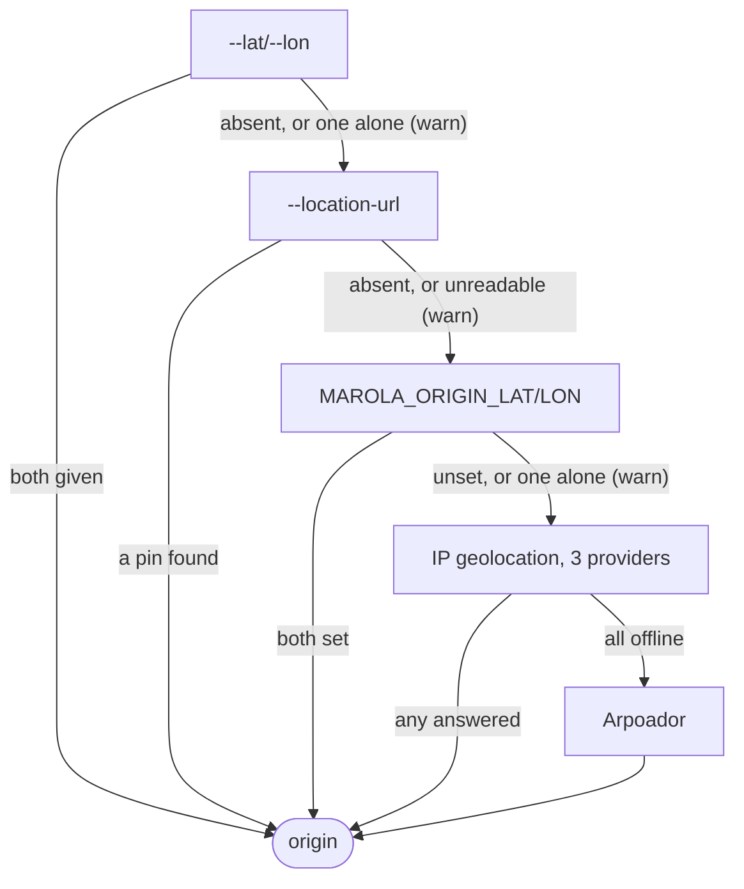

# CLI reference

The `cli` jar has two entry points (`build.sbt`):

- `marola.Main`, the CLI: `just run -- <flags>`, `java -jar` on the assembled jar, or the image
  (`ENTRYPOINT java -jar /app/marola.jar`, default arguments `--brief`).
- `marola.agent.SwimConditionsMcpServer`, the [MCP tool server](#mcp-server): `just mcp-server`.

Both read their settings from `MAROLA_*` environment variables: see
[Configuration reference](4-reference_config.md). How to set up Ollama and run it for the first
time is [Run it locally](https://docs.marola.dev/1-Using-marola/RUN-LOCALLY/).

## Modes

`Main` runs one mode per call. The first row whose flag is present wins:

| Flag | Mode | Recipe |
|---|---|---|
| `--report-sighting <kind> <beach> [note]` | Append a sighting to `MAROLA_LOCAL_SIGHTING_STORE_PATH`. `kind` is `jellyfish`, `whale` or `pollution` (any case); the note is one argument, so quote it | |
| `--analyze-photo <path>` | Describe a photo with `MAROLA_LOCAL_VISION_MODEL`, which must be multimodal | |
| `--ask "<question>"` | Answer from the knowledge corpus: retrieve with the embedder, answer with the LLM, print the passages' sources | `just ask "<question>"` |
| `--reindex` | Re-embed the corpus into `MAROLA_KNOWLEDGE_INDEX_PATH` (normally automatic when a file or the embed model changes) | `just knowledge-index` |
| `--benchmark` | The [benchmark](#benchmark) | `just benchmark` |
| `--site [area-id]` | The map's [boards](#site-boards) | |
| `--serve-chat [port]` | The [chat server](#chat-server) | |
| none of the above | The [recommendation](#recommendation-the-default) | `just run` |

A flag that takes a value reads the next argument and is ignored when there is none. A
`--report-sighting` with an unknown kind, or with fewer than two values, does not match, and the
call falls through to the next row. The optional value of `--site` and `--serve-chat` is ignored
when it starts with `--`.

## Recommendation (the default)

Tomorrow's best hour per nearby beach: up to six beaches, scored, with water quality, facilities,
trails and tides where the sources have them.

| Flag | Effect |
|---|---|
| `--lat <deg> --lon <deg>` | Search from this point. Both or neither: one alone is ignored with a warning |
| `--location-url <url>` | Search from a Google Maps pin: `@lat,lon`, `q=`/`query=`/`ll=`, or a place URL's `!3dlat!4dlon` (`Coordinates.fromMapsUrl`). Expand a `maps.app.goo.gl` short link first (`curl -sIL`); an unreadable URL is ignored with a warning |
| `--summarize` | Add the LLM summary: a draft from `recommendation_prompt.json`, then a second pass from `review_prompt.json` that scores and corrects it (both compiled prompts on the classpath) |
| `--brief` | One line per beach: no detail block for the top pick, no sea lore |
| `--no-lore` | Drop the sea-lore paragraph (as `MAROLA_SEA_LORE=off`) |

The origin is the first of these that yields a point; the `origin ->` line names which one:

1. `--lat`/`--lon`.
2. `--location-url`.
3. `MAROLA_ORIGIN_LAT`/`MAROLA_ORIGIN_LON` (both or neither).
4. IP geolocation: ipinfo.io, ipwho.is and ip-api.com, the medoid of their answers. It is
   city-level, so the radius becomes at least 20 km.
5. Arpoador, Rio de Janeiro, only when no IP provider answered.

The radius is `MAROLA_BEACH_SEARCH_RADIUS_KM` (15 km by default). With `MAROLA_TRACES=mlflow` the
run is one trace: `marola.recommend`, with `bestPerBeachTomorrow`, `trails` and one `llm.<model>`
span per LLM call under it.

## Benchmark

`--benchmark` runs marola against a plain prompt on the questions in `benchmark_questions.json`
(classpath), in three arms: `baseline` (the plain prompt), and `rag-strict` and `rag-general` (the
corpus, with each `MAROLA_ASK_FALLBACK` behaviour). Retrieval uses `MAROLA_ASK_MIN_SCORE`. It
prints the report (coverage, citations, abstentions, latency and a verdict), writes it to
`./data/benchmark-<yyyyMMdd-HHmm>.md`, and logs it as an MLflow run in the experiment
`<MAROLA_MLFLOW_EXPERIMENT>/benchmark` when `MAROLA_MLFLOW_TRACKING_URI` is set. marola-ml's
benchmark gate runs this mode from the published image.

## Site boards

`--site` builds the board data the map at [marola.dev](https://marola.dev) renders, for one area
of the areas file, or for every area when no id is given.

| Flag | Default | Effect |
|---|---|---|
| `--site [area-id]` | every area | Which area to build |
| `--areas <file>` | `$PWD/site/areas.json` | The areas file |
| `--site-out <dir>` | `$PWD/site/dist` | Where to write |

Each areas-file entry needs `id` (`[a-z0-9-]+`), `name`, `lat`, `lon`, `radius_km`,
`beach_limit`, `tz` (an IANA zone) and `tiles`; `tiles_attribution` is optional. An entry missing
a required field is dropped. The build writes `<out>/data/areas.json` and, per area,
`<out>/data/<id>/<today>.json` and `<tomorrow>.json` (the boards, against
`cli/src/main/resources/board.schema.json`) and `latest.json` naming both. A missing areas file or
an unknown id prints a message and writes nothing. A failed build exits 1, because a deploy would
publish whatever partial output it left.

To try it from this repo, with the test fixture's areas file:
`just run -- --site floripa --areas cli/src/test/resources/site/areas.json`.
The real areas file, the page and the deploy are
[marola-site](https://github.com/marola-dev/marola-site)'s, which runs the published image with
`--site --areas`.

## Chat server

`--serve-chat` runs an HTTP server for the map's chat widget, in the foreground until Ctrl+C. The
port is the flag's value, 8787 by default. It listens on every interface, not only localhost, and
answers any origin (`Access-Control-Allow-Origin: *`).

| Request | Response |
|---|---|
| `GET /health` | 200 `{"status":"ok"}` |
| `POST /ask` with `{"question": "..."}` | 200 `{"answer", "safety", "sources": [{"title", "source"}]}` |
| `POST /ask` without a string `question` | 400 `{"error":"missing question"}` |
| `/ask` with another method | 405 `{"error":"POST only"}` |
| `/ask` when retrieval or the LLM fails | 500 `{"error": "<the failure>"}` |
| `OPTIONS` on either path | 204, the CORS preflight |

`answer` carries the emergency footer when `safety` is true, that is when a retrieved passage came
from the corpus's safety documents (MIP-0022). Exposing the server through a Cloudflare Tunnel and
connecting the widget is in [Chat and MCP](https://docs.marola.dev/1-Using-marola/CHAT-AND-MCP/).

## MCP server

`SwimConditionsMcpServer` speaks MCP over stdio as `marola-swim-conditions` 0.1.0. This repo's
`.mcp.json` registers it for Claude Code as `just mcp-server`; any other MCP client can launch
`just mcp-server`, or `java -cp <the assembled jar> marola.agent.SwimConditionsMcpServer`. Each
tool returns one text item holding JSON.

| Tool | Arguments | Returns |
|---|---|---|
| `find_nearby_beaches` | `lat`, `lon` (required), `radius_km` (default 15) | The six nearest named beaches: `[{name, lat, lon, distance_km}]` |
| `get_swim_recommendation` | the same | Tomorrow's best hour per beach: `[{beach_name, distance_km, hour_local, score, sea_temp_c, wind_kmh, wave_height_m, jellyfish_risk, whale_sighting_likelihood, notes, water_quality, water_quality_summary, tides: [{time, height_m, high}]}]` |
| `get_water_quality` | the same | `{source, beaches: [{beach, water_quality: {source, points: [{point, beach, location, lat, lon, latest: {sampled_on, condition, enterococci_per_100ml, rain, water_temp_c}}]}}]}`, or `{"error": "no water-quality provider covers this origin"}` |
| `ask_ocean_question` | `question` (required) | `{answer, safety, sources: [{title, source, score}]}` |

A missing or non-numeric `lat`/`lon` becomes 0, not an error. `get_water_quality` picks its
provider as the CLI does (`MAROLA_WATER_QUALITY_PROVIDER`, by default from the origin), although
its description still says Santa Catarina only.

!!! warning "What the servers do not read"
    `get_swim_recommendation` passes no water-quality client, so its `water_quality` is always
    `null`; ask `get_water_quality` for it. `ask_ocean_question` and the chat server's `/ask`
    answer with the strict fallback and a minimum score of 0, whatever `MAROLA_ASK_FALLBACK` and
    `MAROLA_ASK_MIN_SCORE` say: only `--ask` and `--benchmark` read them.
