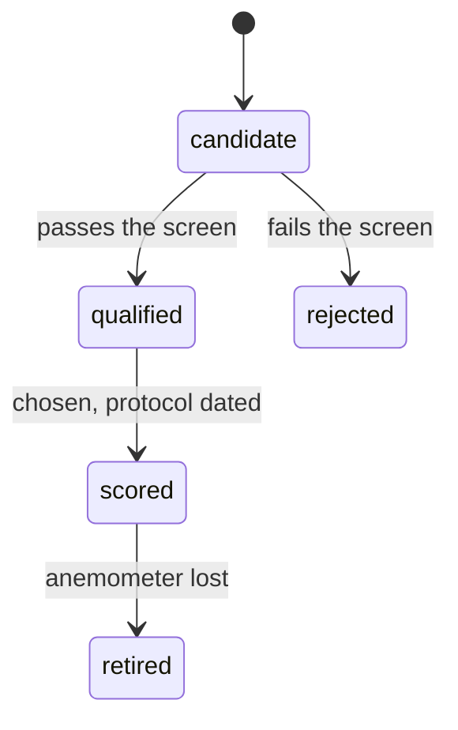

# Ground-truth points

The forecast benchmark ([MIP-0083](https://docs.marola.dev/6-MIPs/MIP-0083-forecast-benchmark-job/))
scores every archived wind forecast against what an instrument measured at the same place and
time. This page documents those instruments: the rules a point must pass, the file that lists
them, and each candidate with what was checked and what was not. The rules are the owner's, set in
[marola-dev/marola#723](https://github.com/marola-dev/marola/issues/723) (2026-10-09); this page
restates them so the code and the protocol can be read side by side.

## What a ground-truth point is

An anemometer whose readings are public: an airport's METAR (hourly, quality-controlled, WMO
format, published by DECEA) or an INMET automatic station (hourly 10 m wind). Never another model,
a reanalysis or a satellite product: a forecast scored against a model only measures how much the
two models agree.

Each state the study covers (SC, RJ, BA) gets at most one scored METAR and one scored INMET
station.

## The rules

- **Strong wind.** A point qualifies only if its own observed history, over the 5 years before the
  study starts, has at least **200 hours a year with mean 10 m wind ≥ 10.8 m/s** (Beaufort 6) and
  at least **5 separate days a year with wind or gusts ≥ 17.2 m/s** (Beaufort 8). Strong wind
  drives waves and decides safety, and it is where ML models have been reported to smooth peaks
  ([arXiv:2312.02658](https://arxiv.org/abs/2312.02658)). Both numbers are placeholders ⚠ until
  #723 calibrates them against the candidates' histories and freezes them.
- **Exposure.** The anemometer sits on open coast, a headland, an island or an airport facing the
  sea, not inside a sheltered bay or behind buildings.
- **Chosen from history only.** Points are picked from past observations before the first cycle
  runs, never after seeing any model's errors. The benchmark archives forecasts at every
  candidate from the start but computes no score for a point until it is `scored`, so no score can
  influence the choice.
- **Replacement.** A state with no qualifying instrument is reported as such; it doesn't get a
  sheltered point to fill the slot. A point that loses its anemometer becomes `retired`, and the
  next qualifying candidate replaces it, recorded as a deviation.
- **Reporting.** Scores are always split by observed wind: calm (< 5.5 m/s), moderate (5.5 to
  10.8 m/s), strong (≥ 10.8 m/s). A state's 12-month answer needs at least 30 strong-wind days
  with matched forecasts.

## The file

`experiment/src/main/resources/experiment/ground-truth.json`, read by
`marola.experiment.GroundTruth`. Its git blob sha is logged with every benchmark cycle, so any change
to it shows in the record.

| Field | Meaning |
|---|---|
| `thresholds` | The strong-wind rule above: `history_years`, `strong_ms`, `strong_hours_per_year`, `gale_ms`, `gale_days_per_year`, and `frozen`, the date the numbers were fixed (`null` while they are placeholders) |
| `points[].id` | `<state>-<station>` in lower case, stable for the life of the study |
| `points[].kind`, `station` | `metar` with an ICAO code (`SB..`), or `inmet` with an automatic-station code (`A606`) |
| `points[].lat`, `lon`, `elevation_m` | The station, not the model grid cell; `null` until read from an official source |
| `points[].anemometer_m` | Anemometer height above ground; `null` until confirmed per station ⚠ |
| `points[].exposure` | Why the site is, or may not be, exposed to the open sea |
| `points[].status` | Where the point is in the lifecycle below |
| `points[].checked` | The URL and date that confirmed the coordinates, or `null` |
| `deviations` | Dated entries, append-only once any point is `scored` |

The loader refuses a file that breaks the rules it can check: a duplicate `id`; a station code
in the wrong format for its kind; a coordinate outside Brazil (an unsigned latitude, usually); a
`qualified` or `scored` point without `checked` coordinates; any `qualified` or `scored` point
while `thresholds.frozen` is `null`; more than one scored METAR or INMET station in a state.

Changing the file is a pull request. Before the first `scored` point, an edit is ordinary review;
after it, every change also adds a `deviations` entry saying what changed and why.

## Candidates

All `candidate`: none has been screened, because the thresholds are not frozen and the 5-year
histories have not been read (MIP-0083 task 2, marola-app#64). Coordinates marked (v) were read on
2026-10-09 from aviationweather.gov's station info (METAR) or INMET's station catalogue
(`apitempo.inmet.gov.br/estacoes/T`).

| id | Station | Coordinates | Exposure | Status of the facts |
|---|---|---|---|---|
| `sc-sbfl` | SBFL, Florianópolis airport (WMO 83899) | −27.671, −48.547, 5 m (v) | island airport in the path of winter cold fronts | likely to qualify ⚠ not measured |
| `sc-a806` | A806, Florianópolis, INMET | −27.6025, −48.6200, 4.87 m (v) | ⚠ | operating since 2003-01-21 (v); #723 named A803, which the catalogue lists as Santa Maria (RS) |
| `rj-sbrj` | SBRJ, Santos Dumont airport (WMO 83755) | −22.910, −43.163, 6 m (v) | inside Guanabara Bay | at risk under the exposure rule |
| `rj-a652` | A652, Forte de Copacabana, INMET | −22.98833, −43.19056, 25.59 m (v) | ⚠ | operating since 2007-05-17 (v) |
| `rj-sbcb` | SBCB, Cabo Frio airport (WMO 83778) | −22.922, −42.074, 3 m (v) | open coast, strong north-east wind | the exposed alternative #723 asks to screen |
| `rj-a606` | A606, Arraial do Cabo, INMET | −22.97528, −42.02139, 5 m (v) | cape on the open coast | operating since 2006-09-21 (v), the exposed alternative #723 asks to screen |
| `ba-sbsv` | SBSV, Salvador airport (WMO 83248) | −12.911, −38.331, 9 m (v) | near the Atlantic shore; steady trade winds | gale days unknown ⚠ |
| `ba-a401` | A401, Salvador, INMET | −13.00556, −38.50583, 47.56 m (v) | ⚠ | operating since 2000-05-12 (v) |
| `ba-sbil` | SBIL, Ilhéus airport (WMO 83349) | −14.816, −39.033, 9 m (v) | airport on the open coast | added here as an exposed BA alternative, as #723 asks |

Not checked yet ⚠: every anemometer height; the INMET stations' exposure; which archive holds 5
years of METARs (aviationweather.gov keeps 15 days). Task 2 settles these before any point is
screened.

## Observation sources

What the benchmark reads for each instrument kind (marola-app#67, `Observations.scala`). Checked
2026-10-09.

- **METAR**: `https://aviationweather.gov/api/data/metar?ids=SBFL,…&format=json&hours=N`, no key
  (v, fetched). Wind arrives in knots and is stored in m/s (× 1852/3600); a `VRB` direction or a
  speed under 2 m/s stores no direction. The wind is labelled `10min_mean`, the averaging ICAO
  Annex 3 sets for METAR ⚠ (the annex was not re-read), and the temperature `instant`.
- **INMET**: the station catalogue (`/estacoes/T`) needs no key, but hourly data is served only on
  the token route `https://apitempo.inmet.gov.br/token/estacao/<from>/<to>/<station>/<token>`: a
  wrong key gets `CHAVE INVÁLIDA!`, and the keyless `/estacao/<from>/<to>/<station>` returns an
  empty body (v, fetched). The token is requested from INMET; there is no self-service sign-up (⚠,
  reported by third parties, not by INMET). Without `INMET_TOKEN` the client logs why and skips, so
  METAR points run meanwhile. INMET answers only Brazilian addresses for most hosts; this check was
  made through a fetcher, not from a GitHub runner ⚠. Wind is a 10-minute mean (`10min_mean`) and
  temperature a 1-minute mean (`1min_mean`), per INMET's
  [Nota Técnica 001/2011](https://www.cemtec.ms.gov.br/wp-content/uploads/2019/02/Nota_Tecnica-Rede_estacoes_INMET.pdf)
  ("Relatórios meteorológicos usam valores médios de 10 minutos"; temperature's "instantâneo" is "a
  média de um minuto"), on a 10 m mast (v). The hourly field names (`VEN_VEL`, `VEN_DIR`, `TEM_INS`,
  `DT_MEDICAO`, `HR_MEDICAO` in UTC as `HHMM`) come from the `inmetpy` client ⚠ until a token lets a
  real response be recorded; the test fixture is that shape, not a recording.
- **Niño-3.4**: CPC's weekly OISST indices against 1991–2020,
  `https://www.cpc.ncep.noaa.gov/data/indices/wksst9120.for` (v, fetched): fixed-width columns,
  Niño-3.4 SST and anomaly in °C per week centre (2026-09-30: 29.9 °C, +3.2 °C). It is one value
  for the basin, stored beside each cycle, not an `ObservationSample`.
