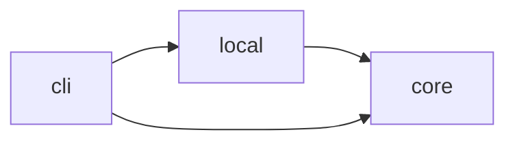

# ADR-0001: The app is three sbt modules, core, local and cli, with dependencies pointing toward core

| | |
|---|---|
| **Status** | Accepted |
| **Date** | 2026-10-04 |
| **Related** | [MIP-0070](https://docs.marola.dev/6-MIPs/MIP-0070-umbrella-and-polyrepo-split/), [MIP-0074](https://docs.marola.dev/6-MIPs/MIP-0074-docs-umbrella-landing-and-repo-docs/), [marola-app#30](https://github.com/marola-dev/marola-app/issues/30) |

## Context

The pipeline's scoring and decision logic is plain Scala that needs no runtime to test, while its
integrations pull in heavy or local-only dependencies: Ollama over HTTP, MLflow, OpenTelemetry,
PDFBox, the local filesystem. The entry points (the CLI, the MCP server, the benchmark runner, the
board writer) are a third concern, and the MCP SDK is needed only there. The split was made before
this repo's history begins (the import of 2026-09-05) and recorded in the umbrella's FUTURE-WORK
§7.3; this ADR takes that record over.

## Decision

`build.sbt` defines three projects, aggregated by a root project that has no sources of its own:

| sbt project | Artifact | Holds | Depends on |
|---|---|---|---|
| `core` | `marola-core` | the pure pipeline (`model`, `scoring`, `Recommender`), the HTTP and JSON helpers, the clients that need only them (Overpass, Open-Meteo, IP geolocation), and the traits the backends implement: `LlmClient`, `VisionClient`, `SightingStore`, `Embedder`, `KnowledgeStore`, `RunLedger`, `Tracing`, `WaterQualityClient` | nothing else in marola |
| `local` | `marola-local` | the implementations of those traits: Ollama (LLM, vision, embedder), MLflow (ledger, tracing), the water-quality agencies and their PDF parsers, the local-file sighting store | `core` |
| `cli` | `marola-cli` | `Main`, `AppConfig`, the MCP and chat servers, the benchmark runner, the board writer | `core`, `local` |

A library dependency goes in the lowest module that needs it: OpenTelemetry and PDFBox in `local`,
the MCP SDK in `cli`; only what every module shares (Kyo, Logback, munit) sits in the common
settings. A module for the Telegram bot is added when that code exists (Phase 1), not before.

## Consequences

- `core` builds without OpenTelemetry, PDFBox or the MCP SDK on its classpath and tests without
  Ollama or MLflow. A caller depends on a trait, never on the `local` class behind it
  (`AppConfig.llmClient` returns an `LlmClient`).
- Each module has its own Scaladoc tree (`just api-docs`: `scala/{core,local,cli}`).
- Commands target a module: `sbt cli/run`, `cli/runMain …`, `cli/assembly`, `cli/nativeImage`. A
  bare `sbt run` at the root has nothing to run.
- `cli` carries two main classes, `marola.Main` and `SwimConditionsMcpServer`, so `build.sbt` pins
  `Main` for `run` and `assembly`; the native binary runs `Main` only.
- Verified after the split, not only compiled: `sbt test` across the module boundaries, `cli/run`
  with and without `--summarize` against live Overpass, Open-Meteo and Ollama, both `E2ESpec`
  tests, and the assembled jar.

## Alternatives

- **One module.** Simpler, but the pure logic would share a classpath with every backend, and
  nothing would stop `core` code from reaching for Ollama or MLflow directly.
- **Referencing marola's build with `RootProject` instead of aggregating the three projects.**
  Tested in a sandbox while the code still shared one repo with an unrelated project, to keep the
  two builds' settings apart. It does keep them apart, but a `RootProject` build cannot be
  addressed as `sbt "name/task"` from the parent (every form failed with "Not a valid project
  ID"), so each task needs its own `cd <dir> && sbt <task>`. Rejected, and moot once the repo held
  marola alone.
